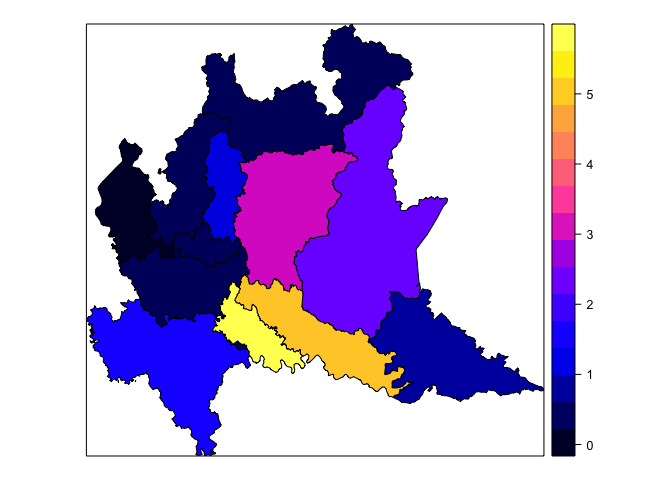
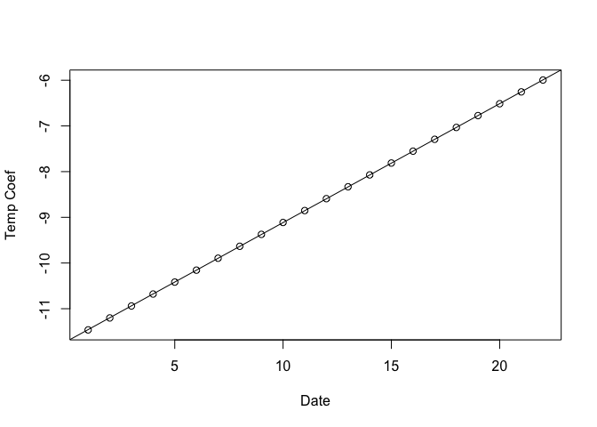
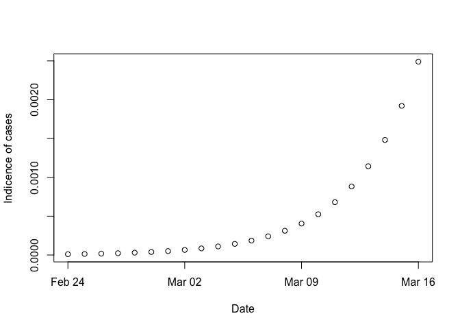
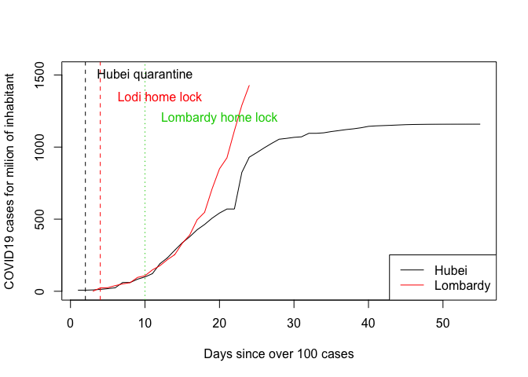
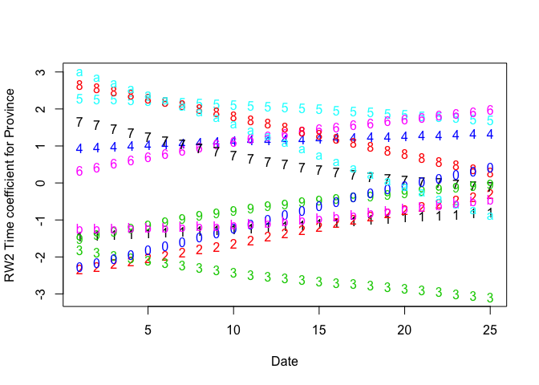
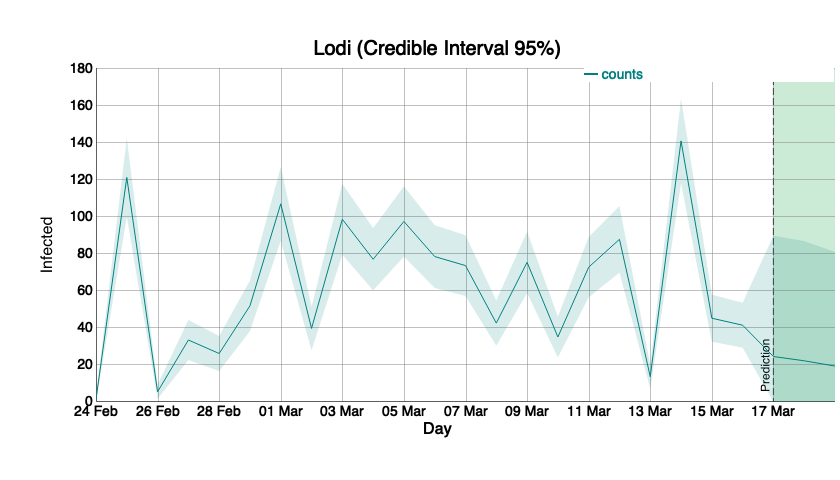

COVID19 - Forecast and predictions using a BYM model - Veneto Region
================
Paolo Girardi
17 Marzo, 2020

    ## Loading required package: sp

    ## Loading required package: spData

    ## To access larger datasets in this package, install the spDataLarge
    ## package with: `install.packages('spDataLarge',
    ## repos='https://nowosad.github.io/drat/', type='source')`

    ## Loading required package: sf

    ## Linking to GEOS 3.6.1, GDAL 2.1.3, PROJ 4.9.3

    ## Checking rgeos availability: TRUE

    ## Loading required package: Matrix

    ## This is INLA_18.07.12 built 2018-07-12 11:07:12 UTC.
    ## See www.r-inla.org/contact-us for how to get help.
    ## To enable PARDISO sparse library; see inla.pardiso()

    ## rgdal: version: 1.4-4, (SVN revision 833)
    ##  Geospatial Data Abstraction Library extensions to R successfully loaded
    ##  Loaded GDAL runtime: GDAL 2.1.3, released 2017/20/01
    ##  Path to GDAL shared files: /Library/Frameworks/R.framework/Versions/3.6/Resources/library/rgdal/gdal
    ##  GDAL binary built with GEOS: FALSE 
    ##  Loaded PROJ.4 runtime: Rel. 4.9.3, 15 August 2016, [PJ_VERSION: 493]
    ##  Path to PROJ.4 shared files: /Library/Frameworks/R.framework/Versions/3.6/Resources/library/rgdal/proj
    ##  Linking to sp version: 1.3-1

    ## Loading required package: zoo

    ## 
    ## Attaching package: 'zoo'

    ## The following objects are masked from 'package:base':
    ## 
    ##     as.Date, as.Date.numeric

# IMPORT DATASETS

# ISTAT Province dataset

``` r
db_istat<-read.csv("https://raw.githubusercontent.com/Paolin83/COVID19_SEIR_model/master/BYM_model/Elenco-comuni-italiani2.csv",sep=";",header=T,dec=",")
pop_provincia<-data.frame(codice_provincia=as.numeric(names(table(db_istat[,3]))),pop=tapply(db_istat[,20],db_istat[,3],sum))
###import international dataset
dat_int<-read.csv("https://raw.githubusercontent.com/CSSEGISandData/COVID-19/master/csse_covid_19_data/csse_covid_19_time_series/time_series_19-covid-Confirmed.csv",header=T)
hubei<-as.numeric(dat_int[dat_int$Province.State=="Hubei",5:dim(dat_int)[2]])

###import updated italian dataset  for each province
dat_csv<-read.csv("https://raw.githubusercontent.com/pcm-dpc/COVID-19/master/dati-province/dpc-covid19-ita-province.csv",header=T)
dat_csv<-merge(dat_csv,pop_provincia,by=c("codice_provincia"),all.y=TRUE)
dat_csv<-dat_csv[dat_csv$codice_provincia<112,]
#select a Region, in this example "Lombardia" Code region 3
Region<-3
dat_csv<-dat_csv[dat_csv$codice_regione==Region,]
dat_csv$denominazione_provincia<-droplevels(dat_csv$denominazione_provincia)
#### number of province
nprov<-length(table(dat_csv$denominazione_provincia)[table(dat_csv$denominazione_provincia)>0])

#order the obsercation for date and space, useful for INLA later....
dat_csv<-dat_csv[order(dat_csv$data),]
dat_csv<-dat_csv[order(dat_csv$codice_provincia),]
###space ID
dat_csv$ID<-as.factor(dat_csv$codice_provincia)
levels(dat_csv$ID)<-1:length(levels(dat_csv$ID))
dat_csv$ID<-as.numeric(dat_csv$ID)
#calculate new_cases
dat_csv$cumulative_cases<-dat_csv$totale_casi
dat_csv$totale_casi[dat_csv$data!="2020-02-24 18:00:00"]<-unlist(tapply(dat_csv$totale_casi,dat_csv$ID,diff))
dat_csv$totale_casi[dat_csv$totale_casi<0]<-0

#import dataset shapefile Italian province
nc.province <- readShapePoly("../BYM_model/ProvCM01012019_g/ProvCM01012019_g_WGS84.shp")
```

    ## Warning: readShapePoly is deprecated; use rgdal::readOGR or sf::st_read

``` r
nc.province<-nc.province[nc.province$COD_REG==Region,]
nc.province<-nc.province[order(nc.province$COD_PROV),]
nc.province$ID<-as.factor(nc.province$COD_PROV)
levels(nc.province$ID)<-1:length(levels(nc.province$ID))
nc.province$ID<-as.numeric(nc.province$ID)
#Create adjacency matrix
nc.nb <- poly2nb(nc.province,snap=0.01)
nb2INLA("nc.adj", nc.nb)
file.adj <- "nc.adj"
################################
```

# 

\#prior distribution for iid and besag components

``` r
prior.iid = c(1,0.01)
prior.besag = c(1,0.001)
initial.iid = 4
initial.besag = 3
```

\#\#\#\#COVID19 MAPS BYM with INLA
\#\#\#\#\#\#\#\#\#\#\#\#\#\#\#\#\#\#\#\#\#\#\#\#\#\#indexing, for
\#\#\#\# number of days

``` r
dat_csv$t<-as.numeric(dat_csv$data)
days<-max(dat_csv$t)
dat_csv$t3<-dat_csv$t2<-dat_csv$t
#### province
dat_csv$ID2<-dat_csv$ID
##########################
formula.bym= totale_casi ~ 1+f(ID, model = "bym", graph = file.adj, param = c(prior.iid, prior.besag), initial = c(initial.iid, initial.besag))
fit_1<-inla(formula.bym, family="poisson", data=dat_csv, E=pop,control.compute = list(dic=T))
summary(fit_1)
```

    ## 
    ## Call:
    ## c("inla(formula = formula.bym, family = \"poisson\", data = dat_csv, ",  "    E = pop, control.compute = list(dic = T))")
    ## 
    ## Time used:
    ##  Pre-processing    Running inla Post-processing           Total 
    ##          2.1656          0.9749          0.1555          3.2960 
    ## 
    ## Fixed effects:
    ##                mean     sd 0.025quant 0.5quant 0.975quant    mode   kld
    ## (Intercept) -9.9197 0.0817   -10.0898  -9.9196      -9.75 -9.9194 8e-04
    ## 
    ## Random effects:
    ## Name   Model
    ##  ID   BYM model 
    ## 
    ## Model hyperparameters:
    ##                                         mean     sd 0.025quant 0.5quant
    ## Precision for ID (iid component)     89.5143 89.628     5.4506  62.6970
    ## Precision for ID (spatial component)  0.3057  0.123     0.1232   0.2873
    ##                                      0.975quant    mode
    ## Precision for ID (iid component)       328.8861 14.4760
    ## Precision for ID (spatial component)     0.5986  0.2498
    ## 
    ## Expected number of effective parameters(std dev): 12.04(0.0178)
    ## Number of equivalent replicates : 21.93 
    ## 
    ## Deviance Information Criterion (DIC) ...............: 16221.45
    ## Deviance Information Criterion (DIC, saturated) ....: 15154.58
    ## Effective number of parameters .....................: 12.05
    ## 
    ## Marginal log-Likelihood:  -8153.32 
    ## Posterior marginals for linear predictor and fitted values computed

``` r
##incidence rate ratio for each province
IRR_mean <- exp(fit_1$summary.random$ID$mean[1:nprov])
nc.province$IRR_mean<-IRR_mean
spplot(nc.province, c( "IRR_mean"))
```

<!-- --> \#Pure
temporal model (RW2) RW2 temporal model

``` r
Date<-seq(as.Date("2020-02-24"),as.Date("2020-02-24")+days-1,1)
formula_t = totale_casi ~ 1+f(t,model="rw2", constr = FALSE)+f(t2,model="iid")
fit_2<-inla(formula_t, family="poisson", data=dat_csv, E=pop,control.compute = list(dic=T))
summary(fit_2)
```

    ## 
    ## Call:
    ## c("inla(formula = formula_t, family = \"poisson\", data = dat_csv, ",  "    E = pop, control.compute = list(dic = T))")
    ## 
    ## Time used:
    ##  Pre-processing    Running inla Post-processing           Total 
    ##          2.1356          9.3009          0.1416         11.5782 
    ## 
    ## Fixed effects:
    ##                mean      sd 0.025quant 0.5quant 0.975quant    mode kld
    ## (Intercept) -1.7867 8918.32  -17511.46  -2.0379   17493.27 -1.7868   0
    ## 
    ## Random effects:
    ## Name   Model
    ##  t   RW2 model 
    ## t2   IID model 
    ## 
    ## Model hyperparameters:
    ##                       mean        sd 0.025quant  0.5quant 0.975quant
    ## Precision for t  6245.1104 6250.9528   447.0450 4401.3694  22865.785
    ## Precision for t2    0.4098    0.3581     0.0957    0.3039      1.356
    ##                       mode
    ## Precision for t  1237.8500
    ## Precision for t2    0.1918
    ## 
    ## Expected number of effective parameters(std dev): 29.38(0.00)
    ## Number of equivalent replicates : 8.986 
    ## 
    ## Deviance Information Criterion (DIC) ...............: 16237.24
    ## Deviance Information Criterion (DIC, saturated) ....: 15170.36
    ## Effective number of parameters .....................: 22.40
    ## 
    ## Marginal log-Likelihood:  -8529.39 
    ## Posterior marginals for linear predictor and fitted values computed

``` r
plot(Date,fit_2$summary.random$t$mean,ylab="Temp Coef",xlab="Date")
```

<!-- -->

``` r
#estimating a linear model without the first obs
lm_fit<-lm(fit_2$summary.random$t$mean~I(1:days),subset=-1)
coef(lm_fit)[2]
```

    ## I(1:days) 
    ##  0.260283

``` r
plot(1:days,fit_2$summary.random$t$mean,ylab="Temp Coef",xlab="Date")
abline(lm_fit)
```

<!-- -->

``` r
##Incidence rate ratios, the rate of increase od cases respect to time 1
plot(Date,exp(fit_2$summary.random$t$mean),ylab="Indicence of cases",xlab="Date")
```

<!-- -->

\#interaction model type 4 (complete time trend interaction to estimate
specific curves for each province)

``` r
####specification
formula.intIV<- totale_casi ~f(ID,model="bym",graph=file.adj) +
  f(t,model="rw2",constr = FALSE) +
  f(t2,model="iid") +
  f(ID2,model="besag", graph=file.adj,
    group=t3,
    control.group=list(model="rw2"))
#estimation
fit_st4<-inla(formula.intIV, family="poisson", data=dat_csv, E=pop,control.compute = list(dic=T))
summary(fit_st4)
```

    ## 
    ## Call:
    ## c("inla(formula = formula.intIV, family = \"poisson\", data = dat_csv, ",  "    E = pop, control.compute = list(dic = T))")
    ## 
    ## Time used:
    ##  Pre-processing    Running inla Post-processing           Total 
    ##          3.3975         84.4503          0.1845         88.0324 
    ## 
    ## Fixed effects:
    ##                mean     sd 0.025quant 0.5quant 0.975quant    mode   kld
    ## (Intercept) -4.3818 0.4355    -5.2529  -4.3759    -3.5422 -4.3621 1e-04
    ## 
    ## Random effects:
    ## Name   Model
    ##  ID   BYM model 
    ## t   RW2 model 
    ## t2   IID model 
    ## ID2   Besags ICAR model 
    ## 
    ## Model hyperparameters:
    ##                                           mean        sd 0.025quant
    ## Precision for ID (iid component)     1844.3710 1829.2686   119.6471
    ## Precision for ID (spatial component) 1843.1305 1828.0930   126.4882
    ## Precision for t                      6019.5246 5955.2042   433.4982
    ## Precision for t2                        0.2158    0.1287     0.0701
    ## Precision for ID2                       0.0196    0.0030     0.0143
    ##                                       0.5quant 0.975quant      mode
    ## Precision for ID (iid component)     1301.5959  6.695e+03  324.5782
    ## Precision for ID (spatial component) 1303.0170  6.677e+03  345.2679
    ## Precision for t                      4268.4260  2.180e+04 1191.5628
    ## Precision for t2                        0.1830  5.515e-01    0.1367
    ## Precision for ID2                       0.0194  2.630e-02    0.0190
    ## 
    ## Expected number of effective parameters(std dev): 191.24(3.313)
    ## Number of equivalent replicates : 1.38 
    ## 
    ## Deviance Information Criterion (DIC) ...............: 1604.40
    ## Deviance Information Criterion (DIC, saturated) ....: 537.53
    ## Effective number of parameters .....................: 185.48
    ## 
    ## Marginal log-Likelihood:  -1957.83 
    ## Posterior marginals for linear predictor and fitted values computed

#### components

```` r
t_1<-fit_st4$summary.random$t$mean #overall trend
t_2<-fit_st4$summary.random$t2$mean #iid trend
s_1<-fit_st4$summary.random$ID$mean[1:nprov] # spatial CAR component
s_2<-fit_st4$summary.random$ID$mean[(nprov+1):(nprov*2)] # spatial idd
st<-fit_st4$summary.random$ID2$mean # spatio-temporal model with car and ar1 specification ```
## Mean IRR for each province
````

``` r
nc.province$IRR_st<-exp(s_1+apply(t(matrix(st,nrow=nprov)),2,mean))
spplot(nc.province, c( "IRR_st"),main="IRR")
```

<!-- --> \#\# Trends
for province

``` r
trends<-t_1+t(matrix(st,nrow=nprov))
# trends+ specific
matplot(trends)
```

<!-- -->

``` r
#specific for each province
matplot(t(matrix(st,nrow=nprov)))
```

<!-- -->

\#\#\#\#\#\#\#\#\#\#\#\#\#\#\#\#\#\#predictions 3 days forward of new
CODID 19 cases

``` r
Forecast=3
dat_csv2<-dat_csv 
dat_csv2$t<-rep(1:days+days,nprov)
dat_csv2$totale_casi<-NA
dat_csv2<-dat_csv2[dat_csv2$t<=(days+Forecast),]
dat_csv_n<-rbind(dat_csv,dat_csv2)
dat_csv_n$t3<-dat_csv_n$t2<-dat_csv_n$t
#introducting hubei starting on 22/01, quarantine started on 25/01
# applying a smoothing , data has errors
hubei_new_cases<-filter(diff(hubei), rep(1, 5))

plot(hubei/58.5,type="l",ylab="COVID19 cases for milion of inhabitant",ylim=c(0,1530),xlab="Days since over 100 cases")
lines(c(rep(NA,2),cumsum(tapply(dat_csv_n$totale_casi,dat_csv_n$t,sum))/10),col=2)
abline(v=2,col=1,lty=2)
abline(v=4,col=2,lty=2)
abline(v=10,col=3,lty=3)
legend("bottomright",c("Hubei","Lombardy"),lty=1,col=1:2)
text(10,1500,"Hubei quarantine")
text(12,1350,"Lodi home lock",col=2)
text(20,1200,"Lombardy home lock",col=3)
```

<!-- -->

``` r
#province of lodi restrictive measure started on 24/02 lag 28 days, at the beginning of the time series
#other provinces on 11/03 lagged started their restrictions
hubei_lodi<-hubei_new_cases[1:(days+Forecast)]
hubei_others<-c(rep(NA,8),hubei_new_cases[1:(days+Forecast-8)])
dat_csv_n<-dat_csv_n[order(dat_csv_n$codice_provincia,dat_csv_n$t),]
dat_csv_n$hubei<-rep(hubei_others,12)
dat_csv_n$hubei[dat_csv_n$denominazione_provincia=="Lodi"]<-hubei_lodi
#overdispersion
dat_csv_n$over<-1:dim(dat_csv_n)[1]
```

We model the number of cases.

In the rw2 I set constr = FALSE is set to FALSE and that, for this
reason, the intercept is not included in the linear predictor.

``` r
## include overdispersion parameter
formula.intIVn<- totale_casi ~ log(hubei+1)+log(pop)+
  f(t,model="rw2", constr = FALSE) +
  f(t2,model="iid") +f(over,model="iid") +
f(ID,model="bym",graph=file.adj) +
  f(ID2,model="besag", graph=file.adj,
    group=t3,
    control.group=list(model="rw2"))+ f(over,model="iid") 

fit_st4n<-inla(formula.intIVn, family="poisson", data=dat_csv_n,control.compute = list(dic=T),control.predictor = list(link = 1))
summary(fit_st4n)
```

    ## 
    ## Call:
    ## c("inla(formula = formula.intIVn, family = \"poisson\", data = dat_csv_n, ",  "    control.compute = list(dic = T), control.predictor = list(link = 1))" )
    ## 
    ## Time used:
    ##  Pre-processing    Running inla Post-processing           Total 
    ##          3.7658        176.4377          0.2303        180.4339 
    ## 
    ## Fixed effects:
    ##                  mean     sd 0.025quant 0.5quant 0.975quant   mode kld
    ## (Intercept)    0.6193 0.3787    -0.1243   0.6194     1.3620 0.6195   0
    ## log(hubei + 1) 0.0751 0.0326     0.0113   0.0750     0.1394 0.0748   0
    ## log(pop)       0.0496 0.0284    -0.0062   0.0496     0.1053 0.0496   0
    ## 
    ## Random effects:
    ## Name   Model
    ##  t   RW2 model 
    ## t2   IID model 
    ## over   IID model 
    ## ID   BYM model 
    ## ID2   Besags ICAR model 
    ## 
    ## Model hyperparameters:
    ##                                           mean        sd 0.025quant
    ## Precision for t                      37039.156 1.812e+06    40.7704
    ## Precision for t2                         1.815 7.325e-01     0.7568
    ## Precision for over                       4.454 6.784e-01     3.2557
    ## Precision for ID (iid component)      1848.765 1.831e+03   127.4552
    ## Precision for ID (spatial component)  1860.170 1.836e+03   126.4347
    ## Precision for ID2                       56.714 5.003e+01     7.0933
    ##                                      0.5quant 0.975quant    mode
    ## Precision for t                      1214.521  1.809e+05  71.079
    ## Precision for t2                        1.694  3.580e+00   1.466
    ## Precision for over                      4.408  5.921e+00   4.322
    ## Precision for ID (iid component)     1308.371  6.688e+03 348.127
    ## Precision for ID (spatial component) 1318.387  6.715e+03 345.559
    ## Precision for ID2                      42.888  1.879e+02  19.971
    ## 
    ## Expected number of effective parameters(std dev): 184.77(3.934)
    ## Number of equivalent replicates : 1.429 
    ## 
    ## Deviance Information Criterion (DIC) ...............: 1543.53
    ## Deviance Information Criterion (DIC, saturated) ....: 476.66
    ## Effective number of parameters .....................: 177.97
    ## 
    ## Marginal log-Likelihood:  -1626.91 
    ## Posterior marginals for linear predictor and fitted values computed

``` r
#### components
t_1<-fit_st4n$summary.random$t$mean #overall trend
t_2<-fit_st4n$summary.random$t2$mean #iid trend
s_1<-fit_st4n$summary.random$ID$mean[1:nprov] # spatial CAR component
s_2<-fit_st4n$summary.random$ID$mean[(nprov+1):(nprov*2)] # spatial idd
st<-fit_st4n$summary.random$ID2$mean # spatio-temporal coefficients 
## Trends for province
Date_n<-seq(as.Date("2020-02-24"),as.Date("2020-02-24")+days+Forecast-1,1)
trends<-t_1+t(matrix(st,nrow=nprov))
plot(Date_n,t_1,ylab="RW2 Time coefficient",xlab="Date")
```

<!-- -->

``` r
matplot(t(matrix(st,nrow=nprov)),ylab="RW2 Time coefficient for Province",xlab="Date")
```

<!-- -->

``` r
#extract number of cases for lodi
est_lodi<-fit_st4n$summary.fitted.values[dat_csv_n$denominazione_provincia=="Lodi",]


days.before<-Date_n[1:days]
days.ahead<-Date_n[(days+1):(days+Forecast)]
mu.lower<-est_lodi$mean-1.96*est_lodi$sd
mu.lower[mu.lower<0]<-0
mu.upper<-est_lodi$mean+1.96*est_lodi$sd
mu.med<-xts(est_lodi$mean,order.by = c(days.before,days.ahead),frequency = 7)
counts<-mu.med
step.ahead<-Forecast
mu<-xts(x = as.matrix(cbind(counts,mu.lower,mu.upper)) , order.by = c(days.before,days.ahead))
p <- dygraph(mu,main=paste("Lodi (Credible Interval ",100*0.95,"%)",sep = ""),ylab=" Infected",xlab="Day",height=400,width=800) %>%  dySeries(c("mu.lower", "counts", "mu.upper"),label="counts")
p<-p %>% dyLegend(show = "always", hideOnMouseOut = FALSE) %>%  dyShading(from = days.ahead[1], to = days.ahead[step.ahead], color = "#CCEBD6")%>% dyEvent(days.ahead[1], "Prediction", labelLoc = "bottom")
p
```

<!-- -->
