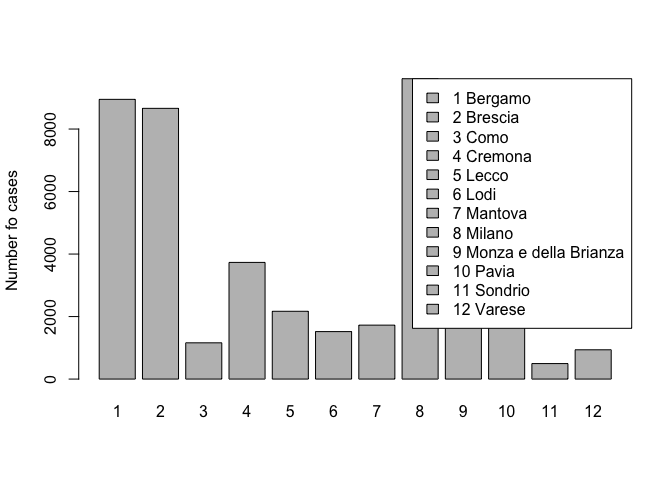
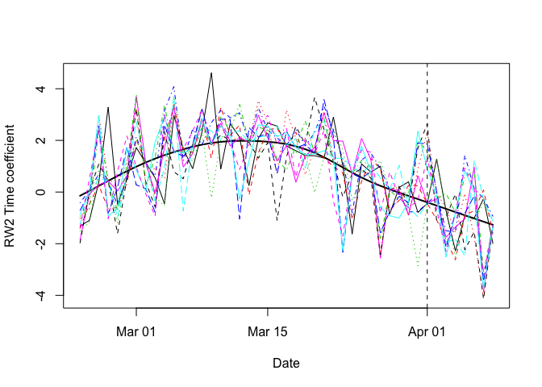

---
output:
  pdf_document: default
  html_document: default
---
COVID19 - Forecast and predictions using a BYM model in Italy
================
Paolo Girardi
24 Marzo, 2020

<a rel="license" href="http://creativecommons.org/licenses/by-nc/4.0/"></a><br />This
work is licensed under a
<a rel="license" href="http://creativecommons.org/licenses/by-nc/4.0/">Creative
Commons Attribution-NonCommercial 4.0 International License</a>.

# Disclaimer

  - We want to investigate the evolution of the coronavirus pandemic in
    Italy

  - Our point of view is that of surveillance with the goal of detecting
    important changes in the underlying (random) process as soon as
    possible after it has occured.

  - We use data provided by Italian Civil Protection Department and the
    analysis was restricted to the Lombardy Region

  - This document is in a draft mode, and it is continuously updated.

  - The layout of the draft must definitely be improved.

\*NB: set the file output format to

\#output:html\_document:  
df\_print: paged  
pdf\_document:  
toc: yes

which performs the same analysis enabling Javascript Pictures.

## The COVID dataset

The present analysis started from the dataset on COVID19 updated in
<https://github.com/pcm-dpc/COVID-19>, database provided by the Italian
Civil Protection.

# Software

Install packages `dygraphs`, `xts` and `EpiDynamics` if not available

``` r
checkpackage <- function(package) {
  if (!package %in% installed.packages()) install.packages(package)
}
checkpackage("dygraphs")
checkpackage("xts")
checkpackage("ggplot2")
checkpackage("spdep")
checkpackage("maptools")
checkpackage("INLA")
checkpackage("rgdal")
```

and load them.

    ## Loading required package: zoo

    ## 
    ## Attaching package: 'zoo'

    ## The following objects are masked from 'package:base':
    ## 
    ##     as.Date, as.Date.numeric

    ## Loading required package: sp

    ## Loading required package: spData

    ## To access larger datasets in this package, install the spDataLarge
    ## package with: `install.packages('spDataLarge',
    ## repos='https://nowosad.github.io/drat/', type='source')`

    ## Loading required package: sf

    ## Linking to GEOS 3.6.1, GDAL 2.1.3, PROJ 4.9.3

    ## Checking rgeos availability: TRUE

    ## Loading required package: Matrix

    ## This is INLA_18.07.12 built 2018-07-12 11:07:12 UTC.
    ## See www.r-inla.org/contact-us for how to get help.
    ## To enable PARDISO sparse library; see inla.pardiso()

    ## rgdal: version: 1.4-4, (SVN revision 833)
    ##  Geospatial Data Abstraction Library extensions to R successfully loaded
    ##  Loaded GDAL runtime: GDAL 2.1.3, released 2017/20/01
    ##  Path to GDAL shared files: /Library/Frameworks/R.framework/Versions/3.6/Resources/library/rgdal/gdal
    ##  GDAL binary built with GEOS: FALSE 
    ##  Loaded PROJ.4 runtime: Rel. 4.9.3, 15 August 2016, [PJ_VERSION: 493]
    ##  Path to PROJ.4 shared files: /Library/Frameworks/R.framework/Versions/3.6/Resources/library/rgdal/proj
    ##  Linking to sp version: 1.3-1

# Datasets loading

    ## Warning: readShapePoly is deprecated; use rgdal::readOGR or sf::st_read

# Spatial analysis with R-INLA and BYM

We modelled COVID 19 cases by means of a BYM (Besag, York and Molli'e)
model using an Integrated Nested Laplace Approximation (INLA).  

For the \(i\)-th Nuts-3 Region (Italian province), the observed number
of COVID19, , was modelled as follows:  
\[
y_{i} \sim Poisson (\lambda_{i})\\
\] with i=1,…, 12. We modelled the incidence of COVID-19 by means of a
BYM model including the population size as offset variable as:  
\[
    log(\frac{\lambda_{i}}{N_{i}})=\alpha+\mu_i+\nu_i,\\
\] where \(\alpha\) is the intercept, \(\mu_i\) and \(\nu_i\) are two
area specific effects with normal distribution modelled using an
intrinsic conditional autoregressive structure (iCAR) and \(N_i\) is the
population size of each NUTS-3 Region.

The parameter were estimated by INLA (Integrated Nested Laplace
Approximation) and R software.

<!-- --> The number
of observed cases \(y_i\) is very different among NUTS-3 regions.

<!-- --> A correct
comparison is the made by incidence cases \(y_i/N_i\), here riported for
x1000 inhabitants. \#Spatial model  
We estimate a BYM model fixing prior distributions for iid and besag
components as follows:

We create new variables that are required by INLA procedure.

    ## 
    ## Call:
    ## c("inla(formula = formula.bym, family = \"poisson\", data = dat_csv, ",  "    E = pop, control.compute = list(dic = T))")
    ## 
    ## Time used:
    ##  Pre-processing    Running inla Post-processing           Total 
    ##          2.4439          1.3345          0.1466          3.9250 
    ## 
    ## Fixed effects:
    ##                mean     sd 0.025quant 0.5quant 0.975quant    mode   kld
    ## (Intercept) -9.3276 0.0657    -9.4646  -9.3276    -9.1907 -9.3276 6e-04
    ## 
    ## Random effects:
    ## Name   Model
    ##  ID   BYM model 
    ## 
    ## Model hyperparameters:
    ##                                         mean      sd 0.025quant 0.5quant
    ## Precision for ID (iid component)     96.7557 96.7986     6.7748  68.1280
    ## Precision for ID (spatial component)  0.6252  0.2534     0.2512   0.5866
    ##                                      0.975quant    mode
    ## Precision for ID (iid component)        354.651 18.5563
    ## Precision for ID (spatial component)      1.231  0.5085
    ## 
    ## Expected number of effective parameters(std dev): 12.15(0.0103)
    ## Number of equivalent replicates : 29.62 
    ## 
    ## Deviance Information Criterion (DIC) ...............: 30849.47
    ## Deviance Information Criterion (DIC, saturated) ....: 29172.81
    ## Effective number of parameters .....................: 12.16
    ## 
    ## Marginal log-Likelihood:  -15475.91 
    ## Posterior marginals for linear predictor and fitted values computed

<!-- --> The image
reported the IRR=exp(\(\mu_i\)), the increase of the Incidence of
Covid-19 in each NUTS-3 Region respect to the overall mean.

\#Temporal model  
We consider the temporal aspect estimating a Bayesian RW2 model to model
the temporal trend of COVID-19 in the reported temporal window. The
observed number of COVID-19 a the time \(t\), , is modelled as follows  
\[
y_{t} \sim Poisson (\lambda_{t})
\] with t=1,…,30. \\end{center} where the quantity
\(\frac{\lambda_{t}}\), is modelled by a Random Walk of order 2 variable
\[
log({\lambda_{it}})=\alpha+\gamma_t+\phi_t, 
\] where \(\alpha\) is the intercept and \(\gamma_t \sim RW2\) are the
coefficients related to the random walk process while
\(\phi_t \sim N(0, \tau_t^{-1} )\) are the temporal specific random
errors. <!-- -->

    ## 
    ## Call:
    ## c("inla(formula = formula_t, family = \"poisson\", data = dat_csv, ",  "    control.compute = list(dic = T))")
    ## 
    ## Time used:
    ##  Pre-processing    Running inla Post-processing           Total 
    ##          2.1472          7.1162          0.1471          9.4104 
    ## 
    ## Fixed effects:
    ##               mean     sd 0.025quant 0.5quant 0.975quant   mode kld
    ## (Intercept) 1.8219 0.2994     1.2335   1.8221     2.4086 1.8226   0
    ## 
    ## Random effects:
    ## Name   Model
    ##  t   RW2 model 
    ## t2   IID model 
    ## 
    ## Model hyperparameters:
    ##                      mean        sd 0.025quant 0.5quant 0.975quant    mode
    ## Precision for t  3752.477 7307.1653     203.54 1750.058  19800.319 507.374
    ## Precision for t2    2.262    0.7552       1.09    2.163      4.027   1.969
    ## 
    ## Expected number of effective parameters(std dev): 31.20(0.2224)
    ## Number of equivalent replicates : 11.54 
    ## 
    ## Deviance Information Criterion (DIC) ...............: 32450.51
    ## Deviance Information Criterion (DIC, saturated) ....: 30773.85
    ## Effective number of parameters .....................: 29.81
    ## 
    ## Marginal log-Likelihood:  -16398.12 
    ## Posterior marginals for linear predictor and fitted values computed

<!-- --><!-- -->
We now consider a BYM model with spatial and temporal components and
their complete interactions (Type IV). The observed number of COVID-19,
, was modelled as: \[
y_{it} \sim Poisson (\lambda_{it})\\
\] with i=1,..,12, and t=1,…,30. We modelled the ratio
\(\frac{\lambda_{it}}{N_{i}}\), the Incidence of COVID-19, with a BYM
model including temporal covariates as follows  
\[
log(\frac{\lambda_{it}}{N_{i}})=\alpha+\mu_i+\nu_i+\gamma_t+\phi_t+\delta_{it},\\
\]

where \(\alpha\) is the intercept and:  
\*space: \(\mu_i\) and \(\nu_i\) are two area specific effects with
normal distribution modelled using an intrinsic conditional
autoregressive structure (iCAR);

\*time: \(\gamma_t\) are the coefficients related to the time process,
while \(\phi_t \sim N(0, \tau_t^{-1} )\) are the temporal specific
random errors. Time process can be autoregressive or a random walk
process (order 1 or 2);

\*space-time: \(\delta_{it}\) are the coefficients related space-time
interactions.

There are many type of spatio-temporal interactions (please see Spatial
and Spatio-temporal Bayesian Models with R - INLA, Blangiardo and
Cameletti).

We explored four spatio-temporal interactions: -Type I: coefficients
\(\delta_{it}\) do not have a spatial or/and temporal structure
(\(\delta_{it}\sim N(0, 1/\tau_{\delta})\)). -TypeII: coefficients
\(\delta_{it}\) have a structured temporal main effect and the
unstructured spatial effect.  
\-TypeIII: coefficients \(\delta_{it}\) have a spatial structure (as
Besag), but are temporally unstructured. -TypeVI: coefficients
\(\delta_{it}\) have both a spatial and temporal structure. It is the
most complex type of space-time interaction.

    ## [1] 2373.81

    ## [1] 2423.391

    ## [1] 2391.412

    ## [1] 2408.876

The time and space component mean estimates can be extracted here

When can represent the
IRR(=exp(\(\mu_i+\frac{1}{T} \sum_{i=t}^{T} \delta_{it}\))) for each
NUTS-3 regions.

<!-- -->

Trend for each
province.

<!-- --><!-- --><!-- -->

    ##           used  (Mb) gc trigger  (Mb) limit (Mb) max used  (Mb)
    ## Ncells 2743704 146.6    4582531 244.8         NA  4582531 244.8
    ## Vcells 6959359  53.1   12255594  93.6      16384 10146329  77.5

<!-- -->

\#\#\#\#\#\#\#\#\#\#\#\#\#\#\#\#\#\#predictions 3 days forward of new
CODID 19 cases

<!-- -->

We modelled the number of cases.

In the rw2 I set constr = FALSE is set to FALSE and that, for this
reason, the intercept is not included in the linear predictor.

    ## 
    ## Call:
    ## c("inla(formula = formula.int_n, family = \"poisson\", data = dat_csv_n, ",  "    control.compute = list(dic = T), control.predictor = list(link = 1))" )
    ## 
    ## Time used:
    ##  Pre-processing    Running inla Post-processing           Total 
    ##          3.2890         51.8123          0.1895         55.2908 
    ## 
    ## Fixed effects:
    ##                  mean     sd 0.025quant 0.5quant 0.975quant   mode kld
    ## (Intercept)    0.4674 0.3370    -0.1943   0.4674     1.1284 0.4675   0
    ## log(hubei + 1) 0.1659 0.0297     0.1074   0.1659     0.2240 0.1661   0
    ## log(pop)       0.0416 0.0253    -0.0081   0.0416     0.0913 0.0417   0
    ## 
    ## Random effects:
    ## Name   Model
    ##  ID   BYM model 
    ## t   RW2 model 
    ## t2   IID model 
    ## t3   IID model 
    ## 
    ## Model hyperparameters:
    ##                                           mean        sd 0.025quant
    ## Precision for ID (iid component)     7.822e-01 3.134e-01     0.3184
    ## Precision for ID (spatial component) 1.858e+03 1.835e+03   125.9139
    ## Precision for t                      1.749e+04 1.761e+04  1075.0826
    ## Precision for t2                     1.854e+04 1.833e+04  1266.0974
    ## Precision for t3                     1.817e+00 1.874e-01     1.4737
    ##                                       0.5quant 0.975quant      mode
    ## Precision for ID (iid component)     7.347e-01      1.531    0.6389
    ## Precision for ID (spatial component) 1.317e+03   6712.240  343.8549
    ## Precision for t                      1.222e+04  64375.222 2867.8223
    ## Precision for t2                     1.313e+04  67006.273 3458.3718
    ## Precision for t3                     1.809e+00      2.211    1.7936
    ## 
    ## Expected number of effective parameters(std dev): 298.79(2.466)
    ## Number of equivalent replicates : 1.205 
    ## 
    ## Deviance Information Criterion (DIC) ...............: 2363.07
    ## Deviance Information Criterion (DIC, saturated) ....: 686.41
    ## Effective number of parameters .....................: 287.22
    ## 
    ## Marginal log-Likelihood:  -1608.68 
    ## Posterior marginals for linear predictor and fitted values computed

<!-- --><!-- --><!-- -->
