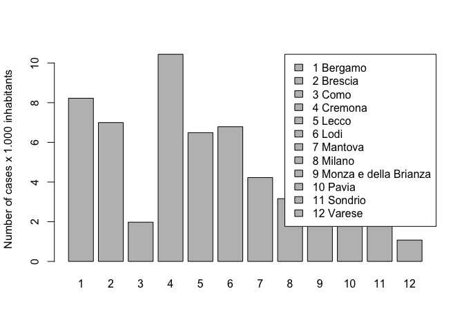
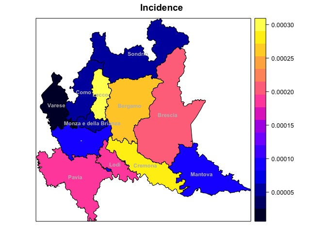
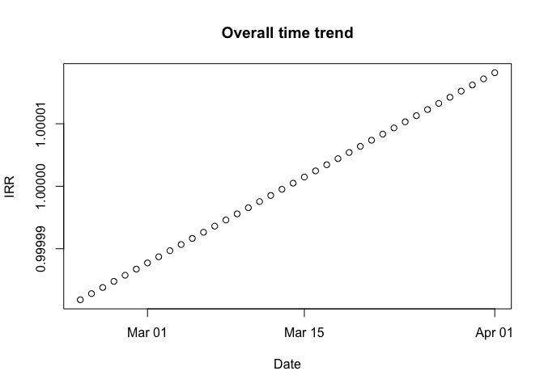
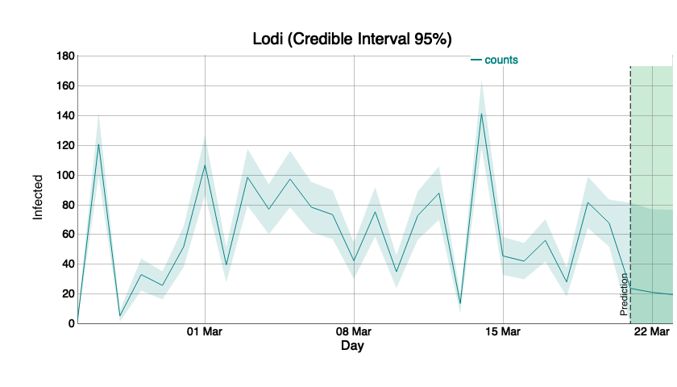

COVID19 - Forecast and predictions using a BYM model in Italy
================
Paolo Girardi
19 Marzo, 2020

<a rel="license" href="http://creativecommons.org/licenses/by-nc/4.0/"></a><br />This
work is licensed under a
<a rel="license" href="http://creativecommons.org/licenses/by-nc/4.0/">Creative
Commons Attribution-NonCommercial 4.0 International License</a>.

# Disclaimer

  - We want to investigate the evolution of the coronavirus pandemic in
    Italy

  - Our point of view is that of surveillance with the goal of detecting
    important changes in the underlying (random) process as soon as
    possible after it has occured.

  - We use data provided by Italian Civil Protection Department and the
    analysis was restricted to the Lombardy Region

  - This document is in a draft mode, and it is continuously updated.

  - The layout of the draft must definitely be improved.

\*NB: set the file output format to

\#output:html\_document:  
df\_print: paged  
pdf\_document:  
toc: yes

which performs the same analysis enabling Javascript Pictures.

## The COVID dataset

The present analysis started from the dataset on COVID19 updated in
<https://github.com/pcm-dpc/COVID-19>, database provided by the Italian
Civil Protection.

# Software

Install packages `dygraphs`, `xts` and `EpiDynamics` if not available

``` r
checkpackage <- function(package) {
  if (!package %in% installed.packages()) install.packages(package)
}
checkpackage("dygraphs")
checkpackage("xts")
checkpackage("ggplot2")
checkpackage("spdep")
checkpackage("maptools")
checkpackage("INLA")
checkpackage("rgdal")
```

and load them.

    ## Loading required package: zoo

    ## 
    ## Attaching package: 'zoo'

    ## The following objects are masked from 'package:base':
    ## 
    ##     as.Date, as.Date.numeric

    ## Loading required package: sp

    ## Loading required package: spData

    ## To access larger datasets in this package, install the spDataLarge
    ## package with: `install.packages('spDataLarge',
    ## repos='https://nowosad.github.io/drat/', type='source')`

    ## Loading required package: sf

    ## Linking to GEOS 3.6.1, GDAL 2.1.3, PROJ 4.9.3

    ## Checking rgeos availability: TRUE

    ## Loading required package: Matrix

    ## This is INLA_18.07.12 built 2018-07-12 11:07:12 UTC.
    ## See www.r-inla.org/contact-us for how to get help.
    ## To enable PARDISO sparse library; see inla.pardiso()

    ## rgdal: version: 1.4-4, (SVN revision 833)
    ##  Geospatial Data Abstraction Library extensions to R successfully loaded
    ##  Loaded GDAL runtime: GDAL 2.1.3, released 2017/20/01
    ##  Path to GDAL shared files: /Library/Frameworks/R.framework/Versions/3.6/Resources/library/rgdal/gdal
    ##  GDAL binary built with GEOS: FALSE 
    ##  Loaded PROJ.4 runtime: Rel. 4.9.3, 15 August 2016, [PJ_VERSION: 493]
    ##  Path to PROJ.4 shared files: /Library/Frameworks/R.framework/Versions/3.6/Resources/library/rgdal/proj
    ##  Linking to sp version: 1.3-1

# Datasets loading

    ## Warning: readShapePoly is deprecated; use rgdal::readOGR or sf::st_read

# Spatial analysis with R-INLA and BYM

We modelled COVID 19 cases by means of a BYM (Besag, York and Molli'e)
model using an Integrated Nested Laplace Approximation (INLA).  

For the \(i\)-th Nuts-3 Region (Italian province), the observed number
of COVID19, , was modelled as follows:  
\[
y_{i} \sim Poisson (\lambda_{i})\\
\] with i=1,…, 12. We modelled the incidence of COVID-19 by means of a
BYM model including the population size as offset variable as:  
\[
    log(\frac{\lambda_{i}}{N_{i}})=\alpha+\mu_i+\nu_i,\\
\] where \(\alpha\) is the intercept, \(\mu_i\) and \(\nu_i\) are two
area specific effects with normal distribution modelled using an
intrinsic conditional autoregressive structure (iCAR) and \(N_i\) is the
population size of each NUTS-3 Region.

The parameter were estimated by INLA (Integrated Nested Laplace
Approximation) and R software.

<!-- --> The number
of observed cases \(y_i\) is very different among NUTS-3 regions.

<!-- --> A correct
comparison is the made by incidence cases \(y_i/N_i\), here riported for
x1000 inhabitants. \#Spatial model  
We estimate a BYM model fixing prior distributions for iid and besag
components as follows:

We create new variables that are required by INLA procedure.

    ## 
    ## Call:
    ## c("inla(formula = formula.bym, family = \"poisson\", data = dat_csv, ",  "    E = pop, control.compute = list(dic = T))")
    ## 
    ## Time used:
    ##  Pre-processing    Running inla Post-processing           Total 
    ##          2.4073          1.2934          0.1946          3.8953 
    ## 
    ## Fixed effects:
    ##               mean     sd 0.025quant 0.5quant 0.975quant    mode    kld
    ## (Intercept) -9.642 0.0695    -9.7872   -9.642     -9.497 -9.6419 0.0027
    ## 
    ## Random effects:
    ## Name   Model
    ##  ID   BYM model 
    ## 
    ## Model hyperparameters:
    ##                                         mean      sd 0.025quant 0.5quant
    ## Precision for ID (iid component)     96.5541 97.7860     6.5107  67.4608
    ## Precision for ID (spatial component)  0.4814  0.1941     0.1943   0.4521
    ##                                      0.975quant    mode
    ## Precision for ID (iid component)       355.9790 17.7444
    ## Precision for ID (spatial component)     0.9449  0.3927
    ## 
    ## Expected number of effective parameters(std dev): 12.08(0.0139)
    ## Number of equivalent replicates : 24.84 
    ## 
    ## Deviance Information Criterion (DIC) ...............: 20982.78
    ## Deviance Information Criterion (DIC, saturated) ....: 19692.33
    ## Effective number of parameters .....................: 12.09
    ## 
    ## Marginal log-Likelihood:  -10535.84 
    ## Posterior marginals for linear predictor and fitted values computed

<!-- -->

    ##  [1] "Bergamo"               "Brescia"              
    ##  [3] "Como"                  "Cremona"              
    ##  [5] "Lecco"                 "Lodi"                 
    ##  [7] "Mantova"               "Milano"               
    ##  [9] "Monza e della Brianza" "Pavia"                
    ## [11] "Sondrio"               "Varese"

The image reported the IRR=exp(\(\mu_i\)), the increase of the Incidence
of Covid-19 in each NUTS-3 Region respect to the overall mean.

\#Temporal model  
We consider the temporal aspect estimating a Bayesian RW2 model to model
the temporal trend of COVID-19 in the reported temporal window. The
observed number of COVID-19 a the time \(t\), , is modelled as follows  
\[
y_{t} \sim Poisson (\lambda_{t})
\] with t=1,…,25. \\end{center} where the quantity
\(\frac{\lambda_{t}}\), is modelled by a Random Walk of order 2 variable
\[
log({\lambda_{it}})=\alpha+\gamma_t+\phi_t, 
\] where \(\alpha\) is the intercept and \(\gamma_t \sim RW2\) are the
coefficients related to the random walk process while
\(\phi_t \sim N(0, \tau_t^{-1} )\) are the temporal specific random
errors. <!-- -->

    ## 
    ## Call:
    ## c("inla(formula = formula_t, family = \"poisson\", data = dat_csv, ",  "    control.compute = list(dic = T))")
    ## 
    ## Time used:
    ##  Pre-processing    Running inla Post-processing           Total 
    ##          2.6652          5.7513          0.1128          8.5292 
    ## 
    ## Fixed effects:
    ##               mean     sd 0.025quant 0.5quant 0.975quant   mode kld
    ## (Intercept) 1.6848 0.3291     1.0375   1.6851     2.3294 1.6859   0
    ## 
    ## Random effects:
    ## Name   Model
    ##  t   RW2 model 
    ## t2   IID model 
    ## 
    ## Model hyperparameters:
    ##                      mean       sd 0.025quant 0.5quant 0.975quant    mode
    ## Precision for t  7063.979 8591.760   136.3762 4082.071  30033.119 179.614
    ## Precision for t2    1.696    0.609     0.7917    1.602      3.149   1.426
    ## 
    ## Expected number of effective parameters(std dev): 26.16(0.2202)
    ## Number of equivalent replicates : 11.47 
    ## 
    ## Deviance Information Criterion (DIC) ...............: 22769.88
    ## Deviance Information Criterion (DIC, saturated) ....: 21479.42
    ## Effective number of parameters .....................: 24.78
    ## 
    ## Marginal log-Likelihood:  -11518.03 
    ## Posterior marginals for linear predictor and fitted values computed

<!-- --><!-- -->
We now consider a BYM model with spatial and temporal components and
their complete interactions (Type IV). The observed number of COVID-19,
, was modelled as: \[
y_{it} \sim Poisson (\lambda_{it})\\
\] with i=1,..,12, and t=1,…,25. We modelled the ratio
\(\frac{\lambda_{it}}{N_{i}}\), the Incidence of COVID-19, with a BYM
model including temporal covariates as follows  
\[
log(\frac{\lambda_{it}}{N_{i}})=\alpha+\mu_i+\nu_i+\gamma_t+\phi_t+\delta_{it},\\
\]

where \(\alpha\) is the intercept and:  
\*space: \(\mu_i\) and \(\nu_i\) are two area specific effects with
normal distribution modelled using an intrinsic conditional
autoregressive structure (iCAR);

\*time: \(\gamma_t \sim RW2\) are the coefficients related to the random
walk process, while \(\phi_t \sim N(0, \tau_t^{-1} )\) are the temporal
specific random errors;

\*space-time: \(\delta_{it}\) are the coefficients related space-time
interactions that in the its type 4 formulation (please see Spatial and
Spatio-temporal Bayesian Models with R - INLA, Blangiardo and Cameletti)
is made by the Kronecker product of time and space indexes.

    ## 
    ## Call:
    ## c("inla(formula = formula.intIV, family = \"poisson\", data = dat_csv, ",  "    E = pop, control.compute = list(dic = T))")
    ## 
    ## Time used:
    ##  Pre-processing    Running inla Post-processing           Total 
    ##          3.1039        116.3646          0.1600        119.6285 
    ## 
    ## Fixed effects:
    ##                mean     sd 0.025quant 0.5quant 0.975quant    mode   kld
    ## (Intercept) -4.3256 0.4184    -5.1688  -4.3173     -3.525 -4.2976 1e-04
    ## 
    ## Random effects:
    ## Name   Model
    ##  ID   BYM model 
    ## t   RW2 model 
    ## t2   IID model 
    ## ID2   Besags ICAR model 
    ## 
    ## Model hyperparameters:
    ##                                           mean        sd 0.025quant
    ## Precision for ID (iid component)     1841.0922 1828.1648   117.9805
    ## Precision for ID (spatial component) 1853.5062 1832.7733   126.7572
    ## Precision for t                      5545.4282 5477.0348   405.5928
    ## Precision for t2                        0.2478    0.1539     0.0801
    ## Precision for ID2                       0.0128    0.0018     0.0095
    ##                                       0.5quant 0.975quant      mode
    ## Precision for ID (iid component)     1297.8813  6.692e+03  318.5943
    ## Precision for ID (spatial component) 1312.3720  6.700e+03  346.2238
    ## Precision for t                      3938.4038  2.007e+04 1125.7514
    ## Precision for t2                        0.2071  6.531e-01    0.1522
    ## Precision for ID2                       0.0126  1.680e-02    0.0124
    ## 
    ## Expected number of effective parameters(std dev): 224.51(3.398)
    ## Number of equivalent replicates : 1.336 
    ## 
    ## Deviance Information Criterion (DIC) ...............: 1918.66
    ## Deviance Information Criterion (DIC, saturated) ....: 628.21
    ## Effective number of parameters .....................: 218.14
    ## 
    ## Marginal log-Likelihood:  -2337.11 
    ## Posterior marginals for linear predictor and fitted values computed

The time and space component mean estimates can be extracted here

When can represent the
IRR(=exp(\(\mu_i+\frac{1}{T} \sum_{i=t}^{T} \delta_{it}\))) for each
NUTS-3 regions.

<!-- -->

Trend for each
province.

<!-- --><!-- --><!-- -->

\#\#\#\#\#\#\#\#\#\#\#\#\#\#\#\#\#\#predictions 3 days forward of new
CODID 19 cases

<!-- -->

We modelled the number of cases.

In the rw2 I set constr = FALSE is set to FALSE and that, for this
reason, the intercept is not included in the linear predictor.

    ## 
    ## Call:
    ## c("inla(formula = formula.intIVn, family = \"poisson\", data = dat_csv_n, ",  "    control.compute = list(dic = T), control.predictor = list(link = 1))" )
    ## 
    ## Time used:
    ##  Pre-processing    Running inla Post-processing           Total 
    ##          3.3214        177.1888          0.1710        180.6812 
    ## 
    ## Fixed effects:
    ##                  mean     sd 0.025quant 0.5quant 0.975quant   mode kld
    ## (Intercept)    0.6774 0.3580    -0.0257   0.6774     1.3795 0.6776   0
    ## log(hubei + 1) 0.0821 0.0315     0.0203   0.0821     0.1439 0.0820   0
    ## log(pop)       0.0538 0.0269     0.0010   0.0538     0.1065 0.0538   0
    ## 
    ## Random effects:
    ## Name   Model
    ##  t   RW2 model 
    ## t2   IID model 
    ## over   IID model 
    ## ID   BYM model 
    ## ID2   Besags ICAR model 
    ## 
    ## Model hyperparameters:
    ##                                          mean        sd 0.025quant
    ## Precision for t                      2371.013 7579.0604    52.6594
    ## Precision for t2                        2.089    0.8049     0.9095
    ## Precision for over                      4.463    0.6165     3.3701
    ## Precision for ID (iid component)     1869.025 1839.3407   127.5238
    ## Precision for ID (spatial component) 1864.967 1837.6957   126.5381
    ## Precision for ID2                      27.701   25.4858     3.5808
    ##                                      0.5quant 0.975quant    mode
    ## Precision for t                       743.169  14746.721 119.707
    ## Precision for t2                        1.961      4.013   1.719
    ## Precision for over                      4.423      5.790   4.346
    ## Precision for ID (iid component)     1326.782   6731.782 349.072
    ## Precision for ID (spatial component) 1322.749   6725.016 345.812
    ## Precision for ID2                      20.479     96.403   9.941
    ## 
    ## Expected number of effective parameters(std dev): 218.34(3.718)
    ## Number of equivalent replicates : 1.374 
    ## 
    ## Deviance Information Criterion (DIC) ...............: 1847.98
    ## Deviance Information Criterion (DIC, saturated) ....: 557.52
    ## Effective number of parameters .....................: 211.56
    ## 
    ## Marginal log-Likelihood:  -1959.49 
    ## Posterior marginals for linear predictor and fitted values computed

<!-- --><!-- --><!-- -->
