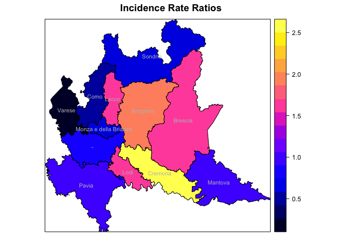
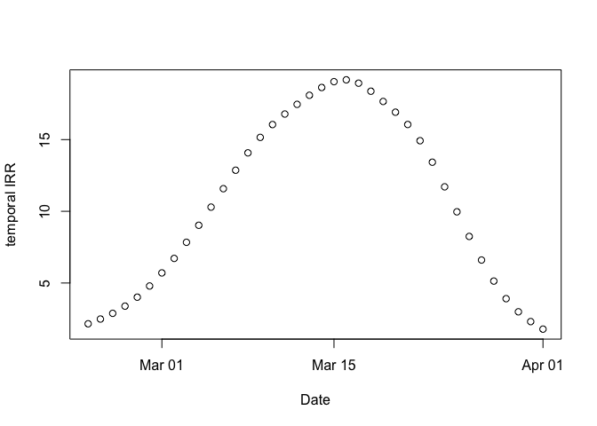
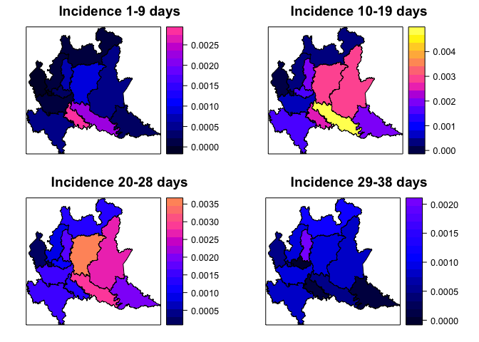
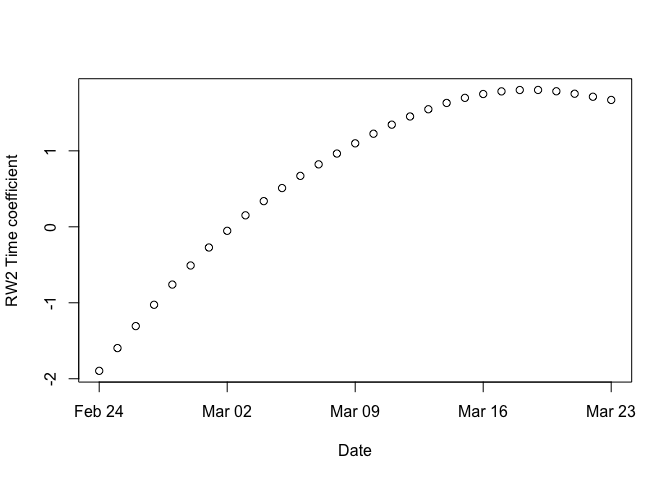

COVID19 - Forecast and predictions using a BYM model in Italy
================
Paolo Girardi
17 Marzo, 2020

<a rel="license" href="http://creativecommons.org/licenses/by-nc/4.0/"></a><br />This
work is licensed under a
<a rel="license" href="http://creativecommons.org/licenses/by-nc/4.0/">Creative
Commons Attribution-NonCommercial 4.0 International License</a>.

# Disclaimer

  - We want to investigate the evolution of the coronavirus pandemic in
    Italy

  - Our point of view is that of surveillance with the goal of detecting
    important changes in the underlying (random) process as soon as
    possible after it has occured.

  - We use data provided by Italian Civil Protection Department and the
    analysis was restricted to the Lombardy Region

  - This document is in a draft mode, and it is continuously updated.

  - The layout of the draft must definitely be improved.

\*NB: set the file output format to

\#output:html\_document:  
df\_print: paged  
pdf\_document:  
toc: yes

which performs the same analysis enabling Javascript Pictures.

## The COVID dataset

The present analysis started from the dataset on COVID19 updated in
<https://github.com/pcm-dpc/COVID-19>, database provided by the Italian
Civil Protection.

# Software

Install packages `dygraphs`, `xts` and `EpiDynamics` if not available

``` r
checkpackage <- function(package) {
  if (!package %in% installed.packages()) install.packages(package)
}
checkpackage("dygraphs")
checkpackage("xts")
checkpackage("ggplot2")
checkpackage("spdep")
checkpackage("maptools")
checkpackage("INLA")
checkpackage("rgdal")
```

and load them.

    ## Loading required package: zoo

    ## 
    ## Attaching package: 'zoo'

    ## The following objects are masked from 'package:base':
    ## 
    ##     as.Date, as.Date.numeric

    ## Loading required package: sp

    ## Loading required package: spData

    ## To access larger datasets in this package, install the spDataLarge
    ## package with: `install.packages('spDataLarge',
    ## repos='https://nowosad.github.io/drat/', type='source')`

    ## Loading required package: sf

    ## Linking to GEOS 3.6.1, GDAL 2.1.3, PROJ 4.9.3

    ## Checking rgeos availability: TRUE

    ## Loading required package: Matrix

    ## This is INLA_18.07.12 built 2018-07-12 11:07:12 UTC.
    ## See www.r-inla.org/contact-us for how to get help.
    ## To enable PARDISO sparse library; see inla.pardiso()

    ## rgdal: version: 1.4-4, (SVN revision 833)
    ##  Geospatial Data Abstraction Library extensions to R successfully loaded
    ##  Loaded GDAL runtime: GDAL 2.1.3, released 2017/20/01
    ##  Path to GDAL shared files: /Library/Frameworks/R.framework/Versions/3.6/Resources/library/rgdal/gdal
    ##  GDAL binary built with GEOS: FALSE 
    ##  Loaded PROJ.4 runtime: Rel. 4.9.3, 15 August 2016, [PJ_VERSION: 493]
    ##  Path to PROJ.4 shared files: /Library/Frameworks/R.framework/Versions/3.6/Resources/library/rgdal/proj
    ##  Linking to sp version: 1.3-1

# Datasets loading

    ## Warning: readShapePoly is deprecated; use rgdal::readOGR or sf::st_read

# Spatial analysis with R-INLA and BYM

We modelled COVID 19 cases by means of a BYM (Besag, York and Molli'e)
model using an Integrated Nested Laplace Approximation (INLA).  

For the \(i\)-th Nuts-3 Region (Italian province), the observed number
of COVID19, , was modelled as follows:  
\[
y_{i} \sim Poisson (\lambda_{i})\\
\] with i=1,…, 12. We modelled the incidence of COVID-19 by means of a
BYM model including the population size as offset variable as:  
\[
    log(\frac{\lambda_{i}}{N_{i}})=\alpha+\mu_i+\nu_i,\\
\] where \(\alpha\) is the intercept, \(\mu_i\) and \(\nu_i\) are two
area specific effects with normal distribution modelled using an
intrinsic conditional autoregressive structure (iCAR) and \(N_i\) is the
population size of each NUTS-3 Region.

The parameter were estimated by INLA (Integrated Nested Laplace
Approximation) and R software.

<!-- --> The number
of observed cases \(y_i\) is very different among NUTS-3 regions.

<!-- --> A correct
comparison is the made by incidence cases \(y_i/N_i\), here riported for
x1000 inhabitants. \#Spatial model  
We estimate a BYM model fixing prior distributions for iid and besag
components as follows:

We create new variables that are required by INLA procedure.

    ## 
    ## Call:
    ## c("inla(formula = formula.bym, family = \"poisson\", data = dat_csv, ",  "    E = pop, control.compute = list(dic = T))")
    ## 
    ## Time used:
    ##  Pre-processing    Running inla Post-processing           Total 
    ##          2.7308          2.9343          0.1250          5.7901 
    ## 
    ## Fixed effects:
    ##                mean     sd 0.025quant 0.5quant 0.975quant    mode   kld
    ## (Intercept) -9.8182 0.0775    -9.9792  -9.8182    -9.6575 -9.8181 6e-04
    ## 
    ## Random effects:
    ## Name   Model
    ##  ID   BYM model 
    ## 
    ## Model hyperparameters:
    ##                                         mean      sd 0.025quant 0.5quant
    ## Precision for ID (iid component)     89.7663 89.8621     5.5686  62.9243
    ## Precision for ID (spatial component)  0.3586  0.1443     0.1448   0.3369
    ##                                      0.975quant    mode
    ## Precision for ID (iid component)       329.4661 14.9130
    ## Precision for ID (spatial component)     0.7027  0.2927
    ## 
    ## Expected number of effective parameters(std dev): 12.05(0.0159)
    ## Number of equivalent replicates : 22.90 
    ## 
    ## Deviance Information Criterion (DIC) ...............: 17442.50
    ## Deviance Information Criterion (DIC, saturated) ....: 16300.41
    ## Effective number of parameters .....................: 12.06
    ## 
    ## Marginal log-Likelihood:  -8764.13 
    ## Posterior marginals for linear predictor and fitted values computed

<!-- -->

    ##  [1] "Bergamo"               "Brescia"              
    ##  [3] "Como"                  "Cremona"              
    ##  [5] "Lecco"                 "Lodi"                 
    ##  [7] "Mantova"               "Milano"               
    ##  [9] "Monza e della Brianza" "Pavia"                
    ## [11] "Sondrio"               "Varese"

The image reported the IRR=exp(\(\mu_i\)), the increase of the Incidence
of Covid-19 in each NUTS-3 Region respect to the overall mean.

\#Temporal model  
We consider the temporal aspect estimating a Bayesian RW2 model to model
the temporal trend of COVID-19 in the reported temporal window. The
observed number of COVID-19 a the time \(t\), , is modelled as follows  
\[
y_{t} \sim Poisson (\lambda_{t})
\] with t=1,…,23. \\end{center} where the quantity
\(\frac{\lambda_{t}}\), is modelled by a Random Walk of order 2 variable
\[
log({\lambda_{it}})=\alpha+\gamma_t+\phi_t, 
\] where \(\alpha\) is the intercept and \(\gamma_t \sim RW2\) are the
coefficients related to the random walk process while
\(\phi_t \sim N(0, \tau_t^{-1} )\) are the temporal specific random
errors. <!-- -->

    ## 
    ## Call:
    ## c("inla(formula = formula_t, family = \"poisson\", data = dat_csv, ",  "    control.compute = list(dic = T))")
    ## 
    ## Time used:
    ##  Pre-processing    Running inla Post-processing           Total 
    ##          2.3238          7.3407          0.1141          9.7786 
    ## 
    ## Fixed effects:
    ##               mean     sd 0.025quant 0.5quant 0.975quant   mode kld
    ## (Intercept) 1.6185 0.3437     0.9425    1.619     2.2915 1.6199   0
    ## 
    ## Random effects:
    ## Name   Model
    ##  t   RW2 model 
    ## t2   IID model 
    ## 
    ## Model hyperparameters:
    ##                       mean        sd 0.025quant 0.5quant 0.975quant
    ## Precision for t  10175.946 1.143e+04   360.6930  6490.01  40763.260
    ## Precision for t2     1.545 5.708e-01     0.6899     1.46      2.902
    ##                     mode
    ## Precision for t  744.882
    ## Precision for t2   1.297
    ## 
    ## Expected number of effective parameters(std dev): 24.17(0.2212)
    ## Number of equivalent replicates : 11.42 
    ## 
    ## Deviance Information Criterion (DIC) ...............: 18864.50
    ## Deviance Information Criterion (DIC, saturated) ....: 17722.41
    ## Effective number of parameters .....................: 22.77
    ## 
    ## Marginal log-Likelihood:  -9550.40 
    ## Posterior marginals for linear predictor and fitted values computed

<!-- --><!-- -->
We now consider a BYM model with spatial and temporal components and
their complete interactions (Type IV). The observed number of COVID-19,
, was modelled as: \[
y_{it} \sim Poisson (\lambda_{it})\\
\] with i=1,..,12, and t=1,…,23. We modelled the ratio
\(\frac{\lambda_{it}}{N_{i}}\), the Incidence of COVID-19, with a BYM
model including temporal covariates as follows  
\[
log(\frac{\lambda_{it}}{N_{i}})=\alpha+\mu_i+\nu_i+\gamma_t+\phi_t+\delta_{it},\\
\]

where \(\alpha\) is the intercept and:  
\*space: \(\mu_i\) and \(\nu_i\) are two area specific effects with
normal distribution modelled using an intrinsic conditional
autoregressive structure (iCAR);

\*time: \(\gamma_t \sim RW2\) are the coefficients related to the random
walk process, while \(\phi_t \sim N(0, \tau_t^{-1} )\) are the temporal
specific random errors;

\*space-time: \(\delta_{it}\) are the coefficients related space-time
interactions that in the its type 4 formulation (please see Spatial and
Spatio-temporal Bayesian Models with R - INLA, Blangiardo and Cameletti)
is made by the Kronecker product of time and space indexes.

    ## 
    ## Call:
    ## c("inla(formula = formula.intIV, family = \"poisson\", data = dat_csv, ",  "    E = pop, control.compute = list(dic = T))")
    ## 
    ## Time used:
    ##  Pre-processing    Running inla Post-processing           Total 
    ##          3.1668         93.2568          0.2109         96.6345 
    ## 
    ## Fixed effects:
    ##               mean     sd 0.025quant 0.5quant 0.975quant    mode   kld
    ## (Intercept) -4.362 0.4305    -5.2262  -4.3549     -3.535 -4.3383 1e-04
    ## 
    ## Random effects:
    ## Name   Model
    ##  ID   BYM model 
    ## t   RW2 model 
    ## t2   IID model 
    ## ID2   Besags ICAR model 
    ## 
    ## Model hyperparameters:
    ##                                           mean        sd 0.025quant
    ## Precision for ID (iid component)     1861.6408 1837.7154   119.7411
    ## Precision for ID (spatial component) 1825.6876 1820.9291   125.2519
    ## Precision for t                      5870.2788 5793.5974   426.8144
    ## Precision for t2                        0.2286    0.1396     0.0740
    ## Precision for ID2                       0.0169    0.0026     0.0124
    ##                                       0.5quant 0.975quant      mode
    ## Precision for ID (iid component)     1316.7113  6.735e+03  321.7809
    ## Precision for ID (spatial component) 1287.1049  6.639e+03  342.8314
    ## Precision for t                      4169.3887  2.123e+04 1177.2169
    ## Precision for t2                        0.1922  5.951e-01    0.1422
    ## Precision for ID2                       0.0167  2.250e-02    0.0163
    ## 
    ## Expected number of effective parameters(std dev): 202.32(3.35)
    ## Number of equivalent replicates : 1.364 
    ## 
    ## Deviance Information Criterion (DIC) ...............: 1707.99
    ## Deviance Information Criterion (DIC, saturated) ....: 565.90
    ## Effective number of parameters .....................: 196.59
    ## 
    ## Marginal log-Likelihood:  -2082.93 
    ## Posterior marginals for linear predictor and fitted values computed

The time and space component mean estimates can be extracted here

When can represent the
IRR(=exp(\(\mu_i+\frac{1}{T} \sum_{i=t}^{T} \delta_{it}\))) for each
NUTS-3 regions.

<!-- -->

Trend for each
province.

<!-- --><!-- --><!-- -->

\#\#\#\#\#\#\#\#\#\#\#\#\#\#\#\#\#\#predictions 3 days forward of new
CODID 19 cases

<!-- -->

We modelled the number of cases.

In the rw2 I set constr = FALSE is set to FALSE and that, for this
reason, the intercept is not included in the linear predictor.

    ## 
    ## Call:
    ## c("inla(formula = formula.intIVn, family = \"poisson\", data = dat_csv_n, ",  "    control.compute = list(dic = T), control.predictor = list(link = 1))" )
    ## 
    ## Time used:
    ##  Pre-processing    Running inla Post-processing           Total 
    ##          4.1666        169.7792          1.1110        175.0569 
    ## 
    ## Fixed effects:
    ##                  mean     sd 0.025quant 0.5quant 0.975quant   mode kld
    ## (Intercept)    0.6406 0.3714    -0.0887   0.6407     1.3690 0.6408   0
    ## log(hubei + 1) 0.0778 0.0320     0.0151   0.0777     0.1409 0.0776   0
    ## log(pop)       0.0511 0.0279    -0.0036   0.0511     0.1058 0.0511   0
    ## 
    ## Random effects:
    ## Name   Model
    ##  t   RW2 model 
    ## t2   IID model 
    ## over   IID model 
    ## ID   BYM model 
    ## ID2   Besags ICAR model 
    ## 
    ## Model hyperparameters:
    ##                                          mean        sd 0.025quant
    ## Precision for t                      8428.254 9.604e+04    43.2715
    ## Precision for t2                        1.908 7.608e-01     0.8058
    ## Precision for over                      4.548 6.773e-01     3.3533
    ## Precision for ID (iid component)     1850.239 1.831e+03   127.6612
    ## Precision for ID (spatial component) 1862.633 1.837e+03   126.4751
    ## Precision for ID2                      42.930 4.066e+01     4.3904
    ##                                      0.5quant 0.975quant    mode
    ## Precision for t                       934.572  54873.368  83.119
    ## Precision for t2                        1.784      3.737   1.549
    ## Precision for over                      4.502      6.015   4.413
    ## Precision for ID (iid component)     1309.683   6690.980 348.716
    ## Precision for ID (spatial component) 1320.592   6720.035 345.670
    ## Precision for ID2                      31.322    151.585  12.463
    ## 
    ## Expected number of effective parameters(std dev): 195.59(3.896)
    ## Number of equivalent replicates : 1.411 
    ## 
    ## Deviance Information Criterion (DIC) ...............: 1647.71
    ## Deviance Information Criterion (DIC, saturated) ....: 505.62
    ## Effective number of parameters .....................: 188.87
    ## 
    ## Marginal log-Likelihood:  -1737.32 
    ## Posterior marginals for linear predictor and fitted values computed

<!-- --><!-- --><!-- -->
