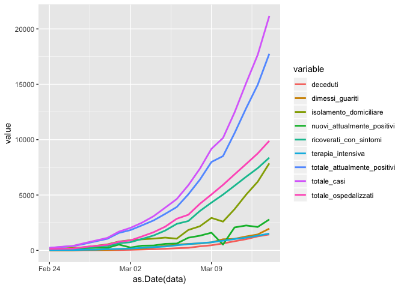

COVID19 - Forecast analysis
================
PG
3/13/2020

## The COVID dataset

The present analysis used the dataset on COVID19 updated in
<https://github.com/pcm-dpc/COVID-19>. We used a SEIR model to predict
the trend of the actual COVID19 epidemic in Italy. We estimated the R0
parameter by means of a linear regression model as reported in
<https://kingaa.github.io/clim-dis/parest/parest.html>

The actual status is

``` r
library(tidyr)
library(dplyr)
```

    ## 
    ## Attaching package: 'dplyr'

    ## The following objects are masked from 'package:stats':
    ## 
    ##     filter, lag

    ## The following objects are masked from 'package:base':
    ## 
    ##     intersect, setdiff, setequal, union

``` r
library(ggplot2)
```

    ## Registered S3 methods overwritten by 'ggplot2':
    ##   method         from 
    ##   [.quosures     rlang
    ##   c.quosures     rlang
    ##   print.quosures rlang

``` r
df <- dat_csv %>%
  select(data, ricoverati_con_sintomi, terapia_intensiva, 
         totale_ospedalizzati, isolamento_domiciliare, 
         totale_attualmente_positivi, nuovi_attualmente_positivi, 
         dimessi_guariti, deceduti, totale_casi) %>%
  gather(key = "variable", value = "value", -data)
head(df, 3)
```

    ##                  data               variable value
    ## 1 2020-02-24 18:00:00 ricoverati_con_sintomi   101
    ## 2 2020-02-25 18:00:00 ricoverati_con_sintomi   114
    ## 3 2020-02-26 18:00:00 ricoverati_con_sintomi   128

``` r
ggplot(df, aes(x = as.Date(data), y = value)) + 
  geom_line(aes(color = variable), size = 1) 
```

<!-- -->

The plot shows an exponential grow. We estimate the R0 parameter by
means of a linear model. R0 indicates how contagious an infectious
disease is. It is also referred to as “the reproduction number” of
COVID19.

\#estimate r0 \#see
<https://kingaa.github.io/clim-dis/parest/parest.html> \#calculate r0
based in the last XX observation

``` r
beta_vec<-NULL
sd_vec<-NULL
for (i in 1:(days-6)){
fit <- lm(log(totale_attualmente_positivi)~t,data=dat_csv[i:days,])
beta_vec<-c(beta_vec,coef(fit)[2])
sd_vec<-c(sd_vec,coef(summary(fit))[2,2])
}

label <-days:7
mean  <- (beta_vec*14+1)
lower <- ((beta_vec-1.96*sd_vec)*14+1)
upper <- ((beta_vec+1.96*sd_vec)*14+1)

df <- data.frame(label, mean, lower, upper)
df$label <- factor(df$label, levels=rev(df$label))

library(ggplot2)
fp <- ggplot(data=df, aes(x=label, y=mean, ymin=lower, ymax=upper)) +
  geom_pointrange() + 
  geom_hline(yintercept=1, lty=2) +  # add a dotted line at x=1 after flip
  coord_flip() +  # flip coordinates (puts labels on y axis)
  xlab("Last days used for the calculation") + ylab("R0 Mean (95% CI)") +
  theme_bw()  # use a white background
print(fp)
```

<!-- -->

  - 

where \(`Y_t`\) is the cumulative number of infected at the time t,
while b is beta, the slope of the regression line.  
We calculate several R0 values, each one based on a different number of
days before the last day. The R0 shows a decreasing trend in the last
period. The slope b indicates the rate of exponetial increase.  
However we considere the value of the last 10 days, because is more
stable.

R
    code:

``` r
head(dat_csv)
```

    ##                  data stato ricoverati_con_sintomi terapia_intensiva
    ## 1 2020-02-24 18:00:00   ITA                    101                26
    ## 2 2020-02-25 18:00:00   ITA                    114                35
    ## 3 2020-02-26 18:00:00   ITA                    128                36
    ## 4 2020-02-27 18:00:00   ITA                    248                56
    ## 5 2020-02-28 18:00:00   ITA                    345                64
    ## 6 2020-02-29 18:00:00   ITA                    401               105
    ##   totale_ospedalizzati isolamento_domiciliare totale_attualmente_positivi
    ## 1                  127                     94                         221
    ## 2                  150                    162                         311
    ## 3                  164                    221                         385
    ## 4                  304                    284                         588
    ## 5                  409                    412                         821
    ## 6                  506                    543                        1049
    ##   nuovi_attualmente_positivi dimessi_guariti deceduti totale_casi tamponi
    ## 1                        221               1        7         229    4324
    ## 2                         90               1       10         322    8623
    ## 3                         74               3       12         400    9587
    ## 4                        203              45       17         650   12014
    ## 5                        233              46       21         888   15695
    ## 6                        228              50       29        1128   18661
    ##   t
    ## 1 1
    ## 2 2
    ## 3 3
    ## 4 4
    ## 5 5
    ## 6 6

``` r
fit1 <- lm(log(totale_attualmente_positivi)~t,data=dat_csv[(days-10):days,])
summary(fit1)
```

    ## 
    ## Call:
    ## lm(formula = log(totale_attualmente_positivi) ~ t, data = dat_csv[(days - 
    ##     10):days, ])
    ## 
    ## Residuals:
    ##       Min        1Q    Median        3Q       Max 
    ## -0.047032 -0.028174 -0.009866  0.008880  0.095695 
    ## 
    ## Coefficients:
    ##             Estimate Std. Error t value Pr(>|t|)    
    ## (Intercept) 6.001345   0.064381   93.22 9.54e-15 ***
    ## t           0.192552   0.004486   42.93 1.01e-11 ***
    ## ---
    ## Signif. codes:  0 '***' 0.001 '**' 0.01 '*' 0.05 '.' 0.1 ' ' 1
    ## 
    ## Residual standard error: 0.04705 on 9 degrees of freedom
    ## Multiple R-squared:  0.9951, Adjusted R-squared:  0.9946 
    ## F-statistic:  1843 on 1 and 9 DF,  p-value: 1.008e-11

The slope coefficient estimated in the linear regression model can be
used to estimate R0.

R0=1+b\*incubation period.

The incubation period for the coronavirus is in mean 5.1 days with a
range from 2-14 days. Please see
<https://www.worldometers.info/coronavirus/coronavirus-incubation-period/>.
In the calculation we considered an incubation period of 14 days for two
reasons: 1) the majority of cases is asymptomatic, contagiousness is
greater than 5, maybe 14. A minority (who made the swab) will have a
duration of about 5 days between the start of contagiousness and swab;
2) 14 days is the worst scenario to consider in this phase.

``` r
slope <-coef(summary(fit1))[2,1]; slope
```

    ## [1] 0.192552

``` r
slope.se <- coef(summary(fit1))[2,2]; slope.se
```

    ## [1] 0.004485606

``` r
### R0 estimates and 95% IC 
R_0=slope*14+1;R_0
```

    ## [1] 3.695728

``` r
(slope+c(-1,1)*1.96*slope.se)*14+1
```

    ## [1] 3.572643 3.818813

We want to make a short term forecast (14 days) with 3 scenario:

\-Scenario 1: 10 exposed people for each COVID-19 case and beta the same
(no restrictions made or even no effects)

\-Scenario 2: 10 exposed people for each COVID-19 case and beta reduced
of 50% (-50% exposed people)

\-Scenario 3: 5 exposed people for each COVID-19 case and beta reduced
of 50% (-50% both exposed people and COVID19 contagious power)

We fix a series of initial parameters: - I0: initial number of COVID-19
cases  
\- R0: initial number of recovered  
\- beta: the quantity connected to R0  
\- N: Italian population  
\- duration: infection duration of COVID-19  
\- sigma0: the coronavirus transmission rate (half of flu epidemic)  
\- mu0: the overall mortality rate

``` r
# initial number of infectus
I0<-dat_csv$totale_attualmente_positivi[dim(dat_csv)[1]]; I0
```

    ## [1] 14955

``` r
# initial number of recovered
R0<-dat_csv$dimessi_guariti[dim(dat_csv)[1]]; R0
```

    ## [1] 1439

``` r
#beta 
beta0<-R_0/(14)
# italian poulation
N=60480000
# duration of COVID19 
duration<-14
#sigma0 is the coronavirus transmission rate fixed to 5%  (half of flu epidemic)
sigma0<-0.05
#mortality rate 
mu0<-1/(82*365.25) # 1/lifespan
```

We use the library(EpiDynamics) and the function SEIR() to implement a
SEIR model:


``` r
library(EpiDynamics)

# average number of single connections of an infected person
# less contacts, less probability of new infections
# we keep constant the other parameters
forecast<-14
parameters <- c(mu = mu0, beta = beta0, sigma = sigma0, gamma = 1/duration)
f1<-10
initials <- c(S = 0.95, E = (f1*I0/N), I = I0/N, R = R0/N)
seir1 <- SEIR(pars = parameters, init = initials, time = 0:forecast)
parameters <- c(mu = mu0, beta = beta0, sigma = sigma0, gamma = 1/duration)
f2<-5
initials <- c(S = 0.95, E = (f2*I0/N), I = I0/N, R = R0/N)
seir2 <- SEIR(pars = parameters, init = initials, time = 0:forecast)
parameters <- c(mu = mu0, beta = beta0*1/2, sigma = sigma0, gamma = 1/duration)
f3<-5
initials <- c(S = 0.95, E = (f3*I0/N), I = I0/N, R = R0/N)
seir3 <- SEIR(pars = parameters, init = initials, time = 0:forecast)


date<-seq(as.Date("2020-02-24"),as.Date("2020-02-24")+forecast-1+dim(dat_csv)[1],1)
plot(date,c(dat_csv$totale_attualmente_positivi,seir1$results$I[-1]*N),type="l",ylab="Cases",xlab="time",main="Infected")
lines(date,c(dat_csv$totale_attualmente_positivi,seir2$results$I[-1]*N),col=2)
lines(date,c(dat_csv$totale_attualmente_positivi,seir3$results$I[-1]*N),col=3)
lines(date[1:dim(dat_csv)[1]],dat_csv$totale_attualmente_positivi,lwd=2)
legend("topleft",c("first scenario","second scenario","third scenario"),lty=1,col=1:3)
```

<!-- -->

The 3 scenarios show different numbers. If we consider the second
scenario, at the end of the 2 weeks (2020-03-27) the number of infected
is (4.749915710^{4}).

In the next plot the cumulative number of infected.  
At the end of the 2 weeks (2020-03-27) the total number of COVID19 cases
is expected to be
(7.667257510^{4}).

``` r
plot(date,c(dat_csv$totale_casi,(seir1$results$I[-1]+seir1$results$R[-1])*N),type="l",ylab="Cases",xlab="time",main="Cumulative Infected")
lines(date,c(dat_csv$totale_casi,(seir2$results$I[-1]+seir2$results$R[-1])*N),col=2)
lines(date,c(dat_csv$totale_casi,(seir3$results$I[-1]+seir3$results$R[-1])*N),col=3)
lines(date[1:dim(dat_csv)[1]],(dat_csv$totale_casi),lwd=2)
legend("topleft",c("first scenario","second scenario","third scenario"),lty=1,col=1:3)
```

<!-- -->

We make an effort to estimate the effect of restriction measures took by
the Italian Government (11 March 2020). After 14 days (2020-03-27) we
have the current status in the second scenario:  
\- I14=(4.749915710^{4});  
\- R14=(3.259670710^{4});  
\- S14=(5.734812110^{7});  
\- E14=(1.203230610^{5});

We reduce R0 to 1.10 and the number of exposed to the number of
infected. We estimate the trend of the number infected, recovered and
the total cases for other 14 days forward.

``` r
I14=seir2$results$I[length(seir2$results$I)]
R14=seir2$results$R[length(seir2$results$I)]
S14=seir2$results$S[length(seir2$results$I)]
E14=seir2$results$E[length(seir2$results$I)]
forecast2<-14
beta14<-1.1/14
parameters <- c(mu = mu0, beta = beta14, sigma = sigma0, gamma = 1/duration)
initials <- c(S = 1-I14*2-R14, E = I14, I = I14, R = R14)
seir2_2 <- SEIR(pars = parameters, init = initials, time = 0:forecast2)

date<-seq(as.Date("2020-02-24"),as.Date("2020-02-24")+forecast2+forecast-1+dim(dat_csv)[1],1)
plot(date,c(dat_csv$totale_attualmente_positivi,seir2$results$I[-1]*N,seir2_2$results$I[-1]*N),type="l",ylab="Cases",xlab="time",ylim=c(0,((seir2_2$results$I+seir2_2$results$R[-1])*N)[forecast2]),col=2)
```

    ## Warning in seir2_2$results$I + seir2_2$results$R[-1]: longer object length
    ## is not a multiple of shorter object length

``` r
lines(date,c(dat_csv$dimessi_guariti,seir2$results$R[-1]*N,seir2_2$results$R[-1]*N),col=3)
lines(date,c(dat_csv$totale_casi,(seir2$results$I[-1]+seir2$results$R[-1])*N,c(seir2_2$results$I[-1]+seir2_2$results$R[-1])*N),col=1)

legend("topleft",c("All cases","Infected","Recovered"),lty=1,col=1:3)
```

<!-- -->
