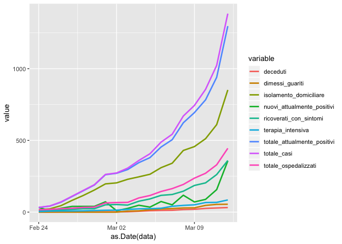

COVID19 - Forecast analysis
================
PG
3/13/2020

fit1 \<- lm(log(totale\_attualmente\_positivi)~t,data=dat\_csv) The
actual situation is

``` r
library(tidyr)
library(dplyr)
```

    ## 
    ## Attaching package: 'dplyr'

    ## The following objects are masked from 'package:stats':
    ## 
    ##     filter, lag

    ## The following objects are masked from 'package:base':
    ## 
    ##     intersect, setdiff, setequal, union

``` r
library(ggplot2)
```

    ## Registered S3 methods overwritten by 'ggplot2':
    ##   method         from 
    ##   [.quosures     rlang
    ##   c.quosures     rlang
    ##   print.quosures rlang

``` r
df <- dat_csv %>%
  select(data, ricoverati_con_sintomi, terapia_intensiva, 
         totale_ospedalizzati, isolamento_domiciliare, 
         totale_attualmente_positivi, nuovi_attualmente_positivi, 
         dimessi_guariti, deceduti, totale_casi) %>%
  gather(key = "variable", value = "value", -data)
head(df, 3)
```

    ##                  data               variable value
    ## 1 2020-02-24 18:00:00 ricoverati_con_sintomi    12
    ## 2 2020-02-25 18:00:00 ricoverati_con_sintomi    12
    ## 3 2020-02-26 18:00:00 ricoverati_con_sintomi    16

``` r
ggplot(df, aes(x = as.Date(data), y = value)) + 
  geom_line(aes(color = variable), size = 1) 
```

<!-- -->

``` r
head(dat_csv)
```

    ##                    data stato codice_regione denominazione_regione     lat
    ## 21  2020-02-24 18:00:00   ITA              5                Veneto 45.4349
    ## 42  2020-02-25 18:00:00   ITA              5                Veneto 45.4349
    ## 63  2020-02-26 18:00:00   ITA              5                Veneto 45.4349
    ## 84  2020-02-27 18:00:00   ITA              5                Veneto 45.4349
    ## 105 2020-02-28 18:00:00   ITA              5                Veneto 45.4349
    ## 126 2020-02-29 17:00:00   ITA              5                Veneto 45.4349
    ##         long ricoverati_con_sintomi terapia_intensiva totale_ospedalizzati
    ## 21  12.33845                     12                 4                   16
    ## 42  12.33845                     12                 7                   19
    ## 63  12.33845                     16                 8                   24
    ## 84  12.33845                     19                 8                   27
    ## 105 12.33845                     24                 9                   33
    ## 126 12.33845                     24                11                   35
    ##     isolamento_domiciliare totale_attualmente_positivi
    ## 21                      16                          32
    ## 42                      23                          42
    ## 63                      45                          69
    ## 84                      82                         109
    ## 105                    116                         149
    ## 126                    154                         189
    ##     nuovi_attualmente_positivi dimessi_guariti deceduti totale_casi
    ## 21                          32               0        1          33
    ## 42                          10               0        1          43
    ## 63                          27               0        2          71
    ## 84                          40               0        2         111
    ## 105                         40               0        2         151
    ## 126                         40               0        2         191
    ##     tamponi t
    ## 21     2200 1
    ## 42     3780 2
    ## 63     4900 3
    ## 84     6164 4
    ## 105    7414 5
    ## 126    8659 6

``` r
fit1 <- lm(log(totale_attualmente_positivi)~t,data=dat_csv)
summary(fit1)
```

    ## 
    ## Call:
    ## lm(formula = log(totale_attualmente_positivi) ~ t, data = dat_csv)
    ## 
    ## Residuals:
    ##      Min       1Q   Median       3Q      Max 
    ## -0.53486 -0.13087 -0.02048  0.16322  0.43111 
    ## 
    ## Coefficients:
    ##             Estimate Std. Error t value Pr(>|t|)    
    ## (Intercept)  3.81179    0.12073   31.57  < 2e-16 ***
    ## t            0.18880    0.01059   17.83 1.94e-12 ***
    ## ---
    ## Signif. codes:  0 '***' 0.001 '**' 0.01 '*' 0.05 '.' 0.1 ' ' 1
    ## 
    ## Residual standard error: 0.2528 on 17 degrees of freedom
    ## Multiple R-squared:  0.9492, Adjusted R-squared:  0.9463 
    ## F-statistic: 317.9 on 1 and 17 DF,  p-value: 1.936e-12

Estimates

``` r
plot(dat_csv$t,log(dat_csv$totale_attualmente_positivi),ylab="log cases",xlab="time")
abline(coef(summary(fit1))[,1])
```

<!-- -->
The slope coefficient estimated in the linear regression model can be
used to estimate R0, the number of

``` r
slope <-coef(summary(fit1))[2,1]; slope
```

    ## [1] 0.1888025

``` r
slope.se <- coef(summary(fit1))[2,2]; slope.se
```

    ## [1] 0.01058848

``` r
### R0 estimates and 95%IC 
### I have used 14 for infection time, but it has a bimodal distribution (tested vs non tested)
R_0=slope*14+1;R_0
```

    ## [1] 3.643235

``` r
(slope+c(-1,1)*1.96*slope.se)*14+1
```

    ## [1] 3.352687 3.933783

We want to make a short term forecast (14 days) with 3 scenario:  
\-Scenario 1: 10 exposed people for each COVID-19 case and beta the same
(no restrictions made or even no effects)  
\-Scenario 2: 10 exposed people for each COVID-19 case and beta reduced
of 50% (-50% exposed people)  
\-Scenario 3: 5 exposed people for each COVID-19 case and beta reduced
of 50% (-50% both exposed people and COVID19 contagious power)

We fix a series of initial parameters: -I0: initial number of COVID-19
cases  
\- R0: initial number of recovered  
\- beta: the quantity connected to R0  
\- N: Italian population  
\- duration: infection duration of COVID-19  
\- sigma0: the coronavirus transmission rate (0.05 is the half of flu
epidemic)  
\- mu0: the overall mortality rate

``` r
# initial number of infectus
I0<-dat_csv$totale_attualmente_positivi[dim(dat_csv)[1]]; I0
```

    ## [1] 1453

``` r
# initial number of recovered
R0<-dat_csv$dimessi_guariti[dim(dat_csv)[1]]; R0
```

    ## [1] 100

``` r
#beta 
beta0<-R_0/(14)
# Veneto population
N=4905854
# duration of COVID19 
duration<-14
#sigma0 is the coronavirus transmission rate fixed to 5%  (half of flu epidemic)
sigma0<-0.05
#mortality rate 
mu0<-1/(82*365.25) # 1/lifespan
```

We use the library(EpiDynamics)

``` r
library(EpiDynamics)
forecast<-14
parameters <- c(mu = mu0, beta = beta0, sigma = sigma0, gamma = 1/duration)
f1<-10
initials <- c(S = 0.95, E = (f1*I0/N), I = I0/N, R = R0/N)
seir1 <- SEIR(pars = parameters, init = initials, time = 0:forecast)
parameters <- c(mu = mu0, beta = beta0, sigma = sigma0, gamma = 1/duration)
f2<-5
initials <- c(S = 0.95, E = (f2*I0/N), I = I0/N, R = R0/N)
seir2 <- SEIR(pars = parameters, init = initials, time = 0:forecast)
parameters <- c(mu = mu0, beta = beta0*1/2, sigma = sigma0, gamma = 1/duration)
f3<-5
initials <- c(S = 0.95, E = (f3*I0/N), I = I0/N, R = R0/N)
seir3 <- SEIR(pars = parameters, init = initials, time = 0:forecast)


date<-seq(as.Date("2020-02-24"),as.Date("2020-02-24")+forecast-1+dim(dat_csv)[1],1)
plot(date,c(dat_csv$totale_attualmente_positivi,seir1$results$I[-1]*N),type="l",ylab="Cases",xlab="time",main="Infected")
lines(date,c(dat_csv$totale_attualmente_positivi,seir2$results$I[-1]*N),col=2)
lines(date,c(dat_csv$totale_attualmente_positivi,seir3$results$I[-1]*N),col=3)
lines(date[1:dim(dat_csv)[1]],dat_csv$totale_attualmente_positivi,lwd=2)
legend("topleft",c("first scenario","second scenario","third scenario"),lty=1,col=1:3)
```

<!-- -->

The 3 scenarios show how measures of restriction can help to reduce the
number of infected.  
At the end of the 2 weeks (2020-03-27) the number of infected is
estimated to be (4582.9107148).  
In the next plot the cumulative number of
infected.

``` r
plot(date,c(dat_csv$totale_casi,(seir1$results$I[-1]+seir1$results$R[-1])*N),type="l",ylab="Cases",xlab="time",main="Cumulative Infected")
lines(date,c(dat_csv$totale_casi,(seir2$results$I[-1]+seir2$results$R[-1])*N),col=2)
lines(date,c(dat_csv$totale_casi,(seir3$results$I[-1]+seir3$results$R[-1])*N),col=3)
lines(date[1:dim(dat_csv)[1]],dat_csv$totale_casi,lwd=2)
legend("topleft",c("first scenario","second scenario","third scenario"),lty=1,col=1:3)
```

<!-- -->

``` r
PlotMods(seir2)
```

<!-- -->
