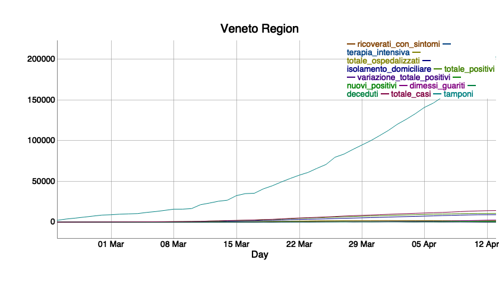
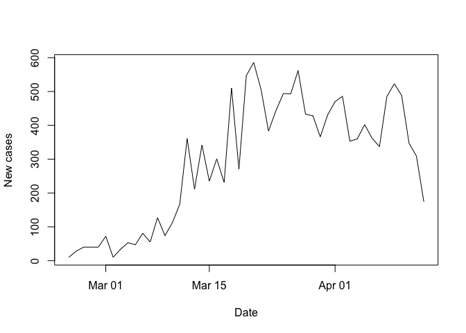
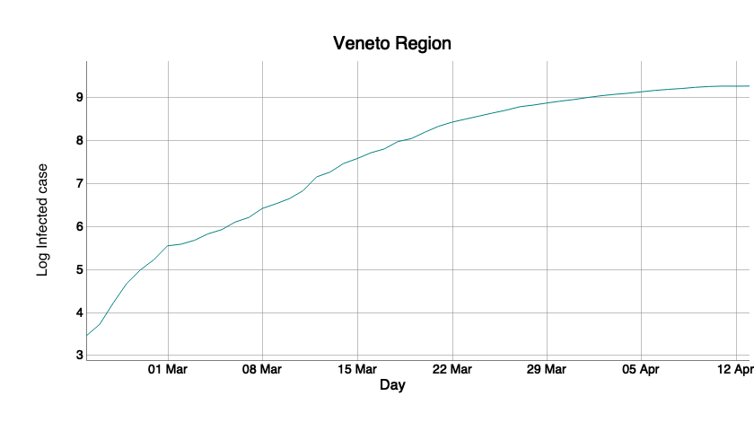

COVID19 - Forecast and predictions using a time dependent SEIR model for
the Veneto Region
================
Paolo Girardi
25 Marzo, 2020

<a rel="license" href="http://creativecommons.org/licenses/by-nc/4.0/"></a><br />This
work is licensed under a
<a rel="license" href="http://creativecommons.org/licenses/by-nc/4.0/">Creative
Commons Attribution-NonCommercial 4.0 International License</a>.

# Disclaimer

  - We want to investigate the evolution of the coronavirus pandemic in
    the Veneto Region from a statistical perspective using aggregated
    data.

  - Our point of view is that of surveillance with the goal of detecting
    important changes in the underlying (random) process as soon as
    possible after it has occured.

  - We use data provided by Italian Civil Protection Department and the
    analysis was restricted to the Veneto Region

  - This document is in a draft mode, and it is continuously updated.

  - The layout of the draft must definitely be improved.

## The COVID dataset

The present analysis started from the dataset on COVID19 updated in
<https://github.com/pcm-dpc/COVID-19>, database provided by the Italian
Civil Protection.

# Software

Install packages `dygraphs`, `xts` and `EpiDynamics` if not available

``` r
checkpackage <- function(package) {
  if (!package %in% installed.packages()) install.packages(package)
}
checkpackage("dygraphs")
checkpackage("xts")
checkpackage("EpiDynamics")
checkpackage("webshot")
checkpackage("bsts")
checkpackage("ggplot2")
checkpackage("knitr")
checkpackage("splines")
```

and load them.

``` r
library(dygraphs)
library(xts)
```

    ## Loading required package: zoo

    ## 
    ## Attaching package: 'zoo'

    ## The following objects are masked from 'package:base':
    ## 
    ##     as.Date, as.Date.numeric

``` r
library(EpiDynamics)
library(webshot)
library(bsts)
```

    ## Loading required package: BoomSpikeSlab

    ## Loading required package: Boom

    ## Loading required package: MASS

    ## 
    ## Attaching package: 'Boom'

    ## The following object is masked from 'package:stats':
    ## 
    ##     rWishart

    ## 
    ## Attaching package: 'BoomSpikeSlab'

    ## The following object is masked from 'package:stats':
    ## 
    ##     knots

    ## 
    ## Attaching package: 'bsts'

    ## The following object is masked from 'package:BoomSpikeSlab':
    ## 
    ##     SuggestBurn

``` r
library(EpiDynamics)
library(ggplot2)
library(knitr)
library(splines)
```

# Source of the data

Download the data from

<https://github.com/pcm-dpc/COVID-19/>

# Results

## Load dataset

``` r
rm(list=ls())
###import italian updated dataset 
dat_csv<-read.csv("https://raw.githubusercontent.com/pcm-dpc/COVID-19/master/dati-regioni/dpc-covid19-ita-regioni.csv",header=T)
#we restricted the analysis to the Veneto Region
dat_csv<-dat_csv[dat_csv$codice_regione==5,]
days<-dim(dat_csv)[1]
dat_csv$t<-1:days
# The total number of epidemic day is
days
```

    ## [1] 31

Several outcomes can be potentially monitored, that is

``` r
names(dat_csv[,-c(1:2,13)])
```

    ##  [1] "codice_regione"              "denominazione_regione"      
    ##  [3] "lat"                         "long"                       
    ##  [5] "ricoverati_con_sintomi"      "terapia_intensiva"          
    ##  [7] "totale_ospedalizzati"        "isolamento_domiciliare"     
    ##  [9] "totale_attualmente_positivi" "nuovi_attualmente_positivi" 
    ## [11] "deceduti"                    "totale_casi"                
    ## [13] "tamponi"                     "note_it"                    
    ## [15] "note_en"                     "t"

It is worth noting that some outcomes present negative counts in some
regions. It looks like some of these negative counts are redesignations.
Outcomes presenting negative values cannot be analyzed using the
proposed model.

Then we extract the
timeseries.

``` r
myDateTimeStr1 <- paste(substr(dat_csv$data,1,10),substr(dat_csv$data,12,19))
myPOSIXct1 <- as.POSIXct(myDateTimeStr1, format="%Y-%m-%d %H:%M:%S")
days_dy<-as.Date(myPOSIXct1)
dat_csv_dy<-xts(dat_csv[,-c(1:7,17:19)], order.by = days_dy, frequency = 7)
```

``` r
p <- dygraph(dat_csv_dy,main=paste("Veneto Region",sep =""),xlab="Day",height=400,width=800) 
p
```

<!-- -->
The time series of COVID-19 in the Veneto Region was influenced by the
presence of a hotspot in the small village of Vo
Euganeo.

``` r
plot(days_dy[-1],diff(dat_csv$totale_casi), ylab="New cases",xlab="Date",type="l")
```

<!-- -->
\#\#\# The S(E)IR model (to be revised)

With the aim of predicting the future number of COVID19 cases on the
basis of the actual data, we used a SEIR model applied to the COVID19
epidemic to the Veneto Region

We will consider the classical [SIR
model](https://en.wikipedia.org/wiki/Compartmental_models_in_epidemiology)
\[@Kermack1927\].

The model divides a population of hosts into three classes: susceptible,
infected, recovered. The model describes how the portion of the
population in each of these classes changes with time. Births are
modeled as flows from “elsewhere” into the susceptible class; deaths are
modeled as flows from the \(S\), \(I\), or \(R\) compartment into
“elsewhere”. If \(S\), \(I\), and \(R\) refer to the numbers of
individuals in each compartment, then these **state variables** change
according to the following system of differential equations:
\[\begin{aligned}
\frac{d}{dt}S(t) &= B(t)-\lambda\,S(t)-\mu\,S(t)\\
\frac{d}{dt}I(t) &= \lambda\,S(t)-\gamma\,I(t)-\mu\,I(t)\\
\frac{d}{dt}R(t) &= \gamma\,I(t)-\mu\,R(t).\\
\end{aligned}\] Here, \(B\) is the crude birth rate (births per unit
time), \(\mu\) is the death rate and \(\gamma\) is the recovery rate.
We’ll assume that the force of infection, \(\beta\), for a constant
population \(N\) \[\lambda = \beta\,\frac{I}{N},\] so that the risk of
infection a susceptible faces is proportional to the *prevalence* (the
fraction of the population that is infected). This is known as the
assumption of frequency-dependent transmission.

# The reproduction number of COVID19.

The number of infected individuals \(I\) at time \(t\) is approximately
\[I(t)\;\approx\;I_0\,e^{(R_0-1)\,(\gamma+\mu)\,t}\] where \(I_0\) is
the (small) number of infectives at time \(0\), \(\frac{1}{\gamma}\) is
the infectious period, and \(\frac{1}{\mu}\) is the host lifespan.

\(R_0\) is the reproduction number
(<https://en.wikipedia.org/wiki/Basic_reproduction_number>) and
indicates how contagious an infectious disease is.

Taking logs of both sides, we get

\[\log{I}(t)\;\approx\;\log{I_0}+(R_0-1)\,(\gamma+\mu)\,t,\] which
implies that a semi-log plot of \(I\) vs \(t\) should be approximately
linear with a slope proportional to \(R_0\) and the recovery
rate.

``` r
dat_csv_dy$log_totale_attualmente_positivi<-log(dat_csv_dy$totale_attualmente_positivi)
p <- dygraph(dat_csv_dy$log_totale_attualmente_positivi,main=paste("Veneto Region"),ylab="Log Infected case",xlab="Day",height=400,width=800) 
p
```

<!-- -->

We estimate the \(R_0\) parameter in the linear model.

\[
\log(I(t))= \beta_0 + \beta_1  t +e_t.
\]

The estimated slope coefficient \(\hat\beta_1\) is used to estimate
\(R_0\) as in the following formula:

\[
\widehat\beta_1=(\widehat{R_0}-1)\,(\gamma+\mu)
\] The parameter \(\mu\)\<\<\(\gamma\) and it can not be considered. As
consequence, R0 can be estimated as follows \[
\hat{R_0}=1+\frac{\hat{\beta_1}}{\gamma}
\] Respect to the SIR model, \(R_0\) can be estimated as follows: \[
\hat{R_0}=\frac{\beta}{\gamma}
\] And this was we can retrive the value of \(\beta\) in the SEIR model
by means of \[
\hat{R_0}=\frac{\hat{\beta}}{\gamma}=1+\frac{\hat{\beta_1}}{\gamma}\\
\hat{\beta}=(1+\frac{\hat{\beta_1}}{\gamma})*{\gamma}={\gamma}+\hat{\beta}_1
\] where \(\beta_1\) is the slope coefficient. \\

The incubation period for the coronavirus is in mean 5.1 days with a
range from 2-14 days. Please see
<https://www.worldometers.info/coronavirus/coronavirus-incubation-period/>.
However, the incubation period is used for epidemic diseases that causes
the immediate home isolation of infected subjects. The duration of the
diseases is about 2 weeks.

However, in the calculation of R0 we considered an infectious period of
18 days on the basis of recent publications
(<https://www.nature.com/articles/s41421-020-0148-0>).

We calculate several R0 values, each one based on a mobile window of 5
days, that can be sufficient to estimate a local trend, in order to
assess if the R0 trend is decreasing (how is expected to be). In this
way, the R0 for the first and the last two days of observation is
impossibile to estimate.

``` r
#calculate r0 based with a mobile window of 5 days
#vector for beta and standard deviation
duration<-18
beta_vec<-NULL
sd_vec<-NULL
#for cycle for R0 estimates from days-2 to days+2
for (i in 3:(days-2)){
fit <- lm(log(totale_attualmente_positivi)~t,data=dat_csv[(i-2):(i+2),])
beta_vec<-c(beta_vec,coef(fit)[2])
sd_vec<-c(sd_vec,coef(summary(fit))[2,2])
}

label<-as.Date(substr(dat_csv$data,1,10))[3:(days-2)]


mean  <- 1+(beta_vec*duration)
lower <- 1+((beta_vec-1.96*sd_vec)*duration)
upper <- 1+((beta_vec+1.96*sd_vec)*duration)

df <- data.frame(label, mean, lower, upper)


fp <- ggplot(data=df, aes(x=label, y=mean, ymin=lower, ymax=upper)) +
  geom_pointrange() +
  geom_hline(yintercept=1, lty=2) +  # add a dotted line at x=1 after flip
  xlab("Date") + ylab("R0 Mean (95% CI)") +
  theme_bw() 
print(fp)
```

<!-- -->

The R0 shows a decreasing trend in the last period. We use the estimated
trend between R0 and time to calculate the future R0 value for the next
14 days. We predict beta (and R0) for the next 14 days by means of a
linear regressione model, assuming a Normal distribution for the beta
(the slope).

``` r
#start from the day 7, since vo hotspot can influence the trend
time<-3:(days-2)
weekend<-rep(c(1,2,3,4,5,6,7),ceiling(days/7))[3:(days-2)]
data<-data.frame(time)
beta.model<-glm(beta_vec~time,weights = 1/sd_vec,family=gaussian,data)
summary(beta.model)
```

    ## 
    ## Call:
    ## glm(formula = beta_vec ~ time, family = gaussian, data = data, 
    ##     weights = 1/sd_vec)
    ## 
    ## Deviance Residuals: 
    ##      Min        1Q    Median        3Q       Max  
    ## -0.87302  -0.19561   0.03693   0.20633   1.23373  
    ## 
    ## Coefficients:
    ##              Estimate Std. Error t value Pr(>|t|)    
    ## (Intercept)  0.236786   0.024284   9.750 5.33e-10 ***
    ## time        -0.005156   0.001188  -4.338 0.000207 ***
    ## ---
    ## Signif. codes:  0 '***' 0.001 '**' 0.01 '*' 0.05 '.' 0.1 ' ' 1
    ## 
    ## (Dispersion parameter for gaussian family taken to be 0.2180081)
    ## 
    ##     Null deviance: 9.5533  on 26  degrees of freedom
    ## Residual deviance: 5.4502  on 25  degrees of freedom
    ## AIC: -80.201
    ## 
    ## Number of Fisher Scoring iterations: 2

``` r
anova(beta.model,test="Chisq")
```

    ## Analysis of Deviance Table
    ## 
    ## Model: gaussian, link: identity
    ## 
    ## Response: beta_vec
    ## 
    ## Terms added sequentially (first to last)
    ## 
    ## 
    ##      Df Deviance Resid. Df Resid. Dev  Pr(>Chi)    
    ## NULL                    26     9.5533              
    ## time  1   4.1031        25     5.4502 1.436e-05 ***
    ## ---
    ## Signif. codes:  0 '***' 0.001 '**' 0.01 '*' 0.05 '.' 0.1 ' ' 1

``` r
#there is an effect of the week, as supposed 
#we can use
#summary(gamlss(formula = beta_vec ~ time + bs(weekend, 3),      weights = 1/sd_vec,Lp=1) )
forecast=14
# add 'fit', 'lwr', and 'upr' columns to dataframe (generated by predict)
pre<-predict(beta.model,type='response',newdata=data.frame(time=1:(days+forecast)),se.fit=TRUE)
date<-seq(as.Date("2020-02-24"),as.Date("2020-02-24")+forecast-1+dim(dat_csv)[1],1)
predict <- data.frame(beta_vec=c(rep(NA,2),beta_vec,rep(NA,forecast+2)),time=date,fit=pre$fit,lwr=pre$fit-1*1.96*pre$se.fit,upr=pre$fit+1*1.96*pre$se.fit)
beta.predict<-predict 
r0.predict<-beta.predict
r0.predict[,c(1,3:5)]<-r0.predict[,c(1,3:5)]*duration+1
# plot the points (actual observations), regression line, and confidence interval
p <- ggplot(r0.predict, aes(date,beta_vec))
p <- p + geom_point() +labs(x="Date",y="R0 value") 
p <- p + geom_line(aes(date,fit))
p <- p + geom_ribbon(aes(ymin=lwr,ymax=upr), alpha=0.3)
p
```

    ## Warning: Removed 18 rows containing missing values (geom_point).

<!-- -->

R0 passes from a value of NA in the initial phase to an estimated value
of 1.09 at the ending of the 14-days forecast.  
We use the library(EpiDynamics) and the function SEIR() to implement a
SEIR model:

\[\begin{aligned}
\frac{d}{dt}S(t) &= \mu (N-S)-\beta \frac{SI}{N}-\nu S\\  
\frac{d}{dt}E(t) &= \beta \frac{SI}{N}-(\mu+\sigma) E    \\
\frac{d}{dt}I(t) &=\sigma E- (\mu+\gamma)I \\
\frac{d}{dt}R(t) &= \gamma\,I(t)-\mu\,R(t)+\nu S.\\
\end{aligned}\]


Respect to the previous formulation, the compartment of exposed people
(E) was inserted between the susceptible and infected compartments.  
(<https://en.wikipedia.org/wiki/Bayesian_structural_time_series>). The
parameter \(\nu\) is the rate of vaccination.

We want to make a short term forecast (14 days).

We made a forecast by means of a SEIR model fixing a series of initial
status:  
*S:N, the size of the Veneto Region population  
*E: The number of exposed people, but supposed to be at least 3 times
the infected (3 x I\_start)  
*I\_start: initial number of COVID-19 cases  
*R\_start: initial number of recovered

and parameters:  
\-beta: gamma + slope  
\-gamma= 1/duration of diseases (duration=21 days)  
\-sigma: the coronavirus transmission rate  
\-mu0: the overall mortality rate

``` r
# initial number of infectus
I_start<-dat_csv$totale_attualmente_positivi[dim(dat_csv)[1]]; I_start
```

    ## [1] 5745

``` r
# initial number of recovered, based on the proportion of discharged from the health services
prop<-dat_csv$dimessi_guariti[dim(dat_csv)[1]]/dat_csv$totale_ospedalizzati[dim(dat_csv)[1]]
R_start<-prop*dat_csv$totale_casi[dim(dat_csv)[1]]; R_start
```

    ## [1] 1641.345

``` r
# Veneto population
N=4905864
#  duration of COVID19 diseases 
duration<-18
#mortality rate 
mu0<-1/(82*365.25) # 1/lifespan
```

We try to estimates sigma (from exposed to infected) and the number of
exposed population on the basis of the last 5 days of observed number of
total infected people.

We suppose that the number of total infected \(I(t)\) can be the
realization of a Poisson random variable \[
I(t) \sim Poisson (\theta_t)
\] where \(\theta_t\) is the unknown mean of the random process at the
time \(t\).

The Poisson distribution has a fixed variance that is equal to the mean;
in the next part we try to estimates the parameters considering a
Negative Binomial distribution which allows for overdispersion.

However, the parameter \(\theta_t\) can be supposed to be a realization
of a SEIR model with initial parameters
\(\theta=(\mu,\beta,\sigma, \gamma)\) and initial status
\(S=(S_{start},E_{start},I_{start},R_{start})\).

The parameter \(\sigma\) is our parameter of interest; we estimate
\(\sigma\) fixing \(E_{start}= 3*I_{start}\) minimizing the log
likelihood of the described Poisson distribution (or Negative Binomial
one).

``` r
# number of the last considered days for calibration
last<-10
#I_start
I_1<-dat_csv$totale_attualmente_positivi[(days-last)]
#R_start
R_1<-prop*dat_csv$totale_casi[(days-last)]
#loglikelihood function
LogLikfun <- function (initials,parameters,obs) {
n<-length(obs)
N=4905864
seir_fit <- SEIR(pars = parameters, init = initials, time = 0:last)
#Poisson
sum(dpois(x=obs[-1],lambda = seir_fit$results$I[-1]*N,log=TRUE))
#Neg Binomial
#sum(dnbinom(x=obs[-1],mu=seir_fit$results$I[-1]*N,size=N,log=TRUE))
#SSE
#-sum((obs[-1]-seir_fit$results$I[-1]*N)^2)
}
### logit and its inverse for sigma 
logit <- function (p) log(p/(1-p))    # the logit transform
expit <- function (x) 1/(1+exp(-x))   # inverse logit

f1<-function(par){
#max 0.20 according to https://www.nejm.org/doi/10.1056/NEJMoa2001316 is 1/5.2
sigma<-expit(par)
f_exp<-3*I_1/N
parameters <- c(mu = mu0, beta =(as.numeric(beta_vec[(days-last-2)])+1/duration), sigma = sigma, gamma =1/duration)
initials <- c(S = (1-(f_exp+I_1/N+R_start/N)), E = f_exp, I = I_1/N, R = R_1/N)
-LogLikfun(initials,parameters,dat_csv$totale_attualmente_positivi[c((days-last):days)])
}
est<-optim(fn=f1,par=logit(0.1))
```

    ## Warning in optim(fn = f1, par = logit(0.1)): one-dimensional optimization by Nelder-Mead is unreliable:
    ## use "Brent" or optimize() directly

``` r
est
```

    ## $par
    ## [1] -2.308454
    ## 
    ## $value
    ## [1] 105.3055
    ## 
    ## $counts
    ## function gradient 
    ##       30       NA 
    ## 
    ## $convergence
    ## [1] 0
    ## 
    ## $message
    ## NULL

``` r
expit(est$par)
```

    ## [1] 0.09042524

``` r
f_exp<-3*I_1/N
sigma<-expit(est$par)

parameters <- c(mu = mu0, beta =(as.numeric(beta_vec[(days-last-2)])+1/duration), sigma = sigma, gamma = 1/duration)
initials <- c(S = (1-(f_exp+I_1/N+R_1/N)), E = f_exp, I = I_1/N, R = R_1/N)
pro<-SEIR(pars = parameters, init = initials, time = 0:last)
#predicted vs observed
cbind(pro$results$I*N,dat_csv$totale_attualmente_positivi[c((days-last):days)])
```

    ##           [,1] [,2]
    ##  [1,] 1989.000 1989
    ##  [2,] 2400.986 2274
    ##  [3,] 2783.469 2488
    ##  [4,] 3144.772 2953
    ##  [5,] 3491.069 3169
    ##  [6,] 3829.475 3677
    ##  [7,] 4164.442 4214
    ##  [8,] 4500.106 4644
    ##  [9,] 4840.116 4986
    ## [10,] 5187.637 5351
    ## [11,] 5545.488 5745

The values of initial parameters are

``` r
#mu0
mu0;
```

    ## [1] 3.338842e-05

``` r
#sigma
sigma
```

    ## [1] 0.09042524

``` r
#gamma
1/duration
```

    ## [1] 0.05555556

``` r
#mthe unknowrn fraction of exposed people is
pro$results$E[last+1]
```

    ## [1] 0.001515189

``` r
#that is 
pro$results$E[last+1]/pro$results$I[last+1]
```

    ## [1] 1.340425

``` r
#times the infected
```

# Forecast 1 - Results based on beta coefficient trend

For the beta parameter, we perfomed a simulation on its trend by means
of a Bayesian Structural Time Series using the library bsts of R.  
We estimated a BSTS model specifing a local linear trend and a
seasonality component. The model predicted 1000 trajectories forward of
the beta coefficent.

We made a forecast forward of 14 days dropping the first 100 simulation
as burn-in.

``` r
# Bayesian Structural Time Series
#we drop the first 6 beta_vec
ss <- AddStudentLocalLinearTrend(list(), beta_vec[6:(days-4)])
ss <- AddSeasonal(ss, beta_vec[6:(days-4)], nseasons = 7)
model1 <- bsts(beta_vec[6:(days-4)],
               state.specification = ss,
               niter = 1000,seed=123)
```

    ## =-=-=-=-= Iteration 0 Wed Mar 25 19:32:31 2020 =-=-=-=-=
    ## =-=-=-=-= Iteration 100 Wed Mar 25 19:32:31 2020 =-=-=-=-=
    ## =-=-=-=-= Iteration 200 Wed Mar 25 19:32:31 2020 =-=-=-=-=
    ## =-=-=-=-= Iteration 300 Wed Mar 25 19:32:31 2020 =-=-=-=-=
    ## =-=-=-=-= Iteration 400 Wed Mar 25 19:32:31 2020 =-=-=-=-=
    ## =-=-=-=-= Iteration 500 Wed Mar 25 19:32:31 2020 =-=-=-=-=
    ## =-=-=-=-= Iteration 600 Wed Mar 25 19:32:31 2020 =-=-=-=-=
    ## =-=-=-=-= Iteration 700 Wed Mar 25 19:32:31 2020 =-=-=-=-=
    ## =-=-=-=-= Iteration 800 Wed Mar 25 19:32:31 2020 =-=-=-=-=
    ## =-=-=-=-= Iteration 900 Wed Mar 25 19:32:31 2020 =-=-=-=-=

``` r
par(mfrow = c(1,1))
plot(model1, "components")
```

<!-- -->

``` r
#previsioni
pred1 <- predict(model1, horizon = 16, burn = 100)
par(mfrow = c(1,1))
plot(pred1 , ylab="Beta1 coefficient",main="Data and predictions",ylim=c(-1,1)*IQR(pred1$distribution)+median(pred1$distribution))
```

<!-- -->

``` r
# matrix of beta coefficients
coef<-(pred1$distribution[,3:16])
par(mfrow = c(1,1))
```

For each vector of simulated beta coefficients we perform a SEIR model.
We save the results and plot a credible interval at 50% (25-75%
percentile).

``` r
seir1_sim<-NULL
for(s in 1:dim(coef)[1]){
  # average number of single connections of an infected person
  # less contacts, less probability of new infections
  # we keep constant the other parameters
  forecast<-14
  seir1<-NULL
  for(i in 1:forecast){
    parameters <- c(mu = mu0, beta = (matrix(coef[s,i])+1/duration), sigma = sigma, gamma = 1/duration)
    if( i==1) initials <- c(S = 1-(pro$results$E[last+1]+I_start/N+R_start/N), E = pro$results$E[last+1], I = I_start/N, R = R_start/N)
    if( i>1) initials <- c(S = seir1_temp$results$S[2], E = seir1_temp$results$E[2], I =seir1_temp$results$I[2], R = seir1_temp$results$R[2])
    seir1_temp <- SEIR(pars = parameters, init = initials, time = 0:1)
    seir1 <- rbind(seir1,SEIR(pars = parameters, init = initials, time = 0:1)$results[2,])
  }
  seir1_sim<-rbind(seir1_sim,cbind(rep(s,forecast),seir1))

}
seir1_sim[,2]<-rep(1:forecast,dim(coef)[1])
colnames(seir1_sim)[1]<-"sim"

### confidence limits
I_seir_med<-tapply(seir1_sim$I,seir1_sim$time,median)
I_seir_lwr<-tapply(seir1_sim$I,seir1_sim$time,quantile,p=0.25)
I_seir_upr<-tapply(seir1_sim$I,seir1_sim$time,quantile,p=0.75)

days.before<-date[1:days]
days.ahead<-date[(days+1):(days+forecast)]
step.ahead<-forecast+1
mu.lower<-c(dat_csv$totale_attualmente_positivi,I_seir_lwr*N)
mu.upper<-c(dat_csv$totale_attualmente_positivi,I_seir_upr*N)
mu.med<-xts(c(dat_csv$totale_attualmente_positivi,I_seir_med*N),order.by = c(days.before,days.ahead),frequency = 7)
counts<-mu.med
mu<-xts(x = as.matrix(cbind(counts,mu.lower,mu.upper)) , order.by = c(days.before,days.ahead))
p <- dygraph(mu,main=paste("Veneto Region: Scenario 1 (Credible Interval ",100*0.50,"%)",sep = ""),ylab=" Infected",xlab="Day",height=400,width=800) %>%  dySeries(c("mu.lower", "counts", "mu.upper"),label="counts")
p<-p %>% dyLegend(show = "always", hideOnMouseOut = FALSE) %>%  dyShading(from = days.ahead[1], to = days.ahead[step.ahead], color = "#CCEBD6")%>% dyEvent(days.ahead[1], "Prediction", labelLoc = "bottom")
p
```

<!-- -->

At the end of the 2 weeks (2020-04-08): \*the number of infected is
(9448.9414244).

\*the total number of COVID19 cases is expected to be (1.717059510^{4}).

The estimated (median) numbers of the current scenario by date are:

``` r
S_seir_med<-tapply(seir1_sim$S,seir1_sim$time,median)
E_seir_med<-tapply(seir1_sim$E,seir1_sim$time,median)
R_seir_med<-tapply(seir1_sim$R,seir1_sim$time,median)
forecast<-data.frame(S_seir_med,E_seir_med,I_seir_med,R_seir_med)*N
colnames(forecast)<-c("Susceptible","Exposed","Infected","Removed")
rownames(forecast)<-days.ahead
kable(forecast)
```

|            | Susceptible |  Exposed | Infected |  Removed |
| ---------- | ----------: | -------: | -------: | -------: |
| 2020-03-26 |     4890221 | 7578.266 | 6094.629 | 1970.166 |
| 2020-03-27 |     4889400 | 7710.250 | 6437.102 | 2318.241 |
| 2020-03-28 |     4888633 | 7770.432 | 6770.593 | 2684.963 |
| 2020-03-29 |     4887968 | 7755.351 | 7087.373 | 3069.751 |
| 2020-03-30 |     4887321 | 7698.534 | 7383.864 | 3471.877 |
| 2020-03-31 |     4886658 | 7658.291 | 7658.955 | 3889.629 |
| 2020-04-01 |     4885866 | 7768.700 | 7922.759 | 4322.762 |
| 2020-04-02 |     4885005 | 7861.317 | 8185.637 | 4769.470 |
| 2020-04-03 |     4884268 | 7927.524 | 8431.387 | 5230.595 |
| 2020-04-04 |     4883563 | 7973.661 | 8690.254 | 5709.209 |
| 2020-04-05 |     4882868 | 7866.413 | 8895.582 | 6197.084 |
| 2020-04-06 |     4882319 | 7750.532 | 9092.315 | 6697.046 |
| 2020-04-07 |     4881614 | 7783.517 | 9292.194 | 7205.370 |
| 2020-04-08 |     4880722 | 7756.455 | 9448.941 | 7721.654 |

# Scenario 2 - Forecast based on the last beta coefficient

We estimate a second scenario using a Random Walk on the basis of the
last value of the beta.

``` r
ss<-NULL
set.seed(123)
ss <-   AddLocalLevel(list(), beta_vec[(days-9):(days-4)],sigma=SdPrior(sd_vec[(days-4)]))
model1 <- bsts(beta_vec[(days-9):(days-4)],
               state.specification = ss,
               niter = 1000,seed=123)
```

    ## =-=-=-=-= Iteration 0 Wed Mar 25 19:32:59 2020 =-=-=-=-=
    ## =-=-=-=-= Iteration 100 Wed Mar 25 19:32:59 2020 =-=-=-=-=
    ## =-=-=-=-= Iteration 200 Wed Mar 25 19:32:59 2020 =-=-=-=-=
    ## =-=-=-=-= Iteration 300 Wed Mar 25 19:32:59 2020 =-=-=-=-=
    ## =-=-=-=-= Iteration 400 Wed Mar 25 19:32:59 2020 =-=-=-=-=
    ## =-=-=-=-= Iteration 500 Wed Mar 25 19:32:59 2020 =-=-=-=-=
    ## =-=-=-=-= Iteration 600 Wed Mar 25 19:32:59 2020 =-=-=-=-=
    ## =-=-=-=-= Iteration 700 Wed Mar 25 19:32:59 2020 =-=-=-=-=
    ## =-=-=-=-= Iteration 800 Wed Mar 25 19:32:59 2020 =-=-=-=-=
    ## =-=-=-=-= Iteration 900 Wed Mar 25 19:32:59 2020 =-=-=-=-=

``` r
par(mfrow = c(1,1))
plot(model1, "components")
```

<!-- -->

``` r
#previsioni
pred1 <- predict(model1, horizon = 16, burn = 100)
par(mfrow = c(1,1))
plot(pred1 , ylab="Beta1 coefficient",main="Data and predictions",ylim=c(-1,1)*IQR(pred1$distribution)+median(pred1$distribution))
```

<!-- -->

``` r
# matrix of beta coefficients
coef<-(pred1$distribution[,3:16])
par(mfrow = c(1,1))

seir2_sim<-NULL
for(s in 1:dim(coef)[1]){
  # average number of single connections of an infected person
  # less contacts, less probability of new infections
  # we keep constant the other parameters
  forecast<-14
  seir2<-NULL
  for(i in 1:forecast){
    parameters <- c(mu = mu0, beta = (matrix(coef[s,i])+1/duration), sigma = sigma, gamma = 1/duration)
    if( i==1) initials <- c(S = 1-(pro$results$E[last+1]+I_start/N+R_start/N), E = pro$results$E[last+1], I = I_start/N, R = R_start/N)
    if( i>1) initials <- c(S = seir2_temp$results$S[2], E = seir2_temp$results$E[2], I =seir2_temp$results$I[2], R = seir2_temp$results$R[2])
    seir2_temp <- SEIR(pars = parameters, init = initials, time = 0:1)
    seir2 <- rbind(seir2,SEIR(pars = parameters, init = initials, time = 0:1)$results[2,])
  }
  seir2_sim<-rbind(seir2_sim,cbind(rep(s,forecast),seir2))

}
seir2_sim[,2]<-rep(1:forecast,dim(coef)[1])
colnames(seir2_sim)[1]<-"sim"

### confidence limits
I_seir_med<-tapply(seir2_sim$I,seir2_sim$time,median)
I_seir_lwr<-tapply(seir2_sim$I,seir2_sim$time,quantile,p=0.05)
I_seir_upr<-tapply(seir2_sim$I,seir2_sim$time,quantile,p=0.95)

days.before<-date[1:days]
days.ahead<-date[(days+1):(days+forecast)]
step.ahead<-forecast+1
mu.lower<-c(dat_csv$totale_attualmente_positivi,I_seir_lwr*N)
mu.upper<-c(dat_csv$totale_attualmente_positivi,I_seir_upr*N)
mu.med<-xts(c(dat_csv$totale_attualmente_positivi,I_seir_med*N),order.by = c(days.before,days.ahead),frequency = 7)
counts<-mu.med
mu<-xts(x = as.matrix(cbind(counts,mu.lower,mu.upper)) , order.by = c(days.before,days.ahead))
p <- dygraph(mu,main=paste("Veneto Region: Scenario 2 (Credible Interval ",100*0.90,"%)",sep = ""),ylab=" Infected",xlab="Day",height=400,width=800) %>%  dySeries(c("mu.lower", "counts", "mu.upper"),label="counts")
p<-p %>% dyLegend(show = "always", hideOnMouseOut = FALSE) %>%  dyShading(from = days.ahead[1], to = days.ahead[step.ahead], color = "#CCEBD6")%>% dyEvent(days.ahead[1], "Prediction", labelLoc = "bottom")
p
```

<!-- -->

At the end of the 2 weeks (2020-04-08): \*the number of infected is
(1.135822610^{4}).

\*the total number of COVID19 cases is expected to be (1.950891410^{4}).

The estimated (median) numbers of the second scenario by date are:

``` r
S_seir_med<-tapply(seir2_sim$S,seir2_sim$time,median)
E_seir_med<-tapply(seir2_sim$E,seir2_sim$time,median)
R_seir_med<-tapply(seir2_sim$R,seir2_sim$time,median)
forecast<-data.frame(S_seir_med,E_seir_med,I_seir_med,R_seir_med)*N
colnames(forecast)<-c("Susceptible","Exposed","Infected","Removed")
rownames(forecast)<-days.ahead
kable(forecast)
```

|            | Susceptible |   Exposed |  Infected |  Removed |
| ---------- | ----------: | --------: | --------: | -------: |
| 2020-03-26 |     4890204 |  7594.109 |  6095.326 | 1970.185 |
| 2020-03-27 |     4889304 |  7799.672 |  6442.469 | 2318.387 |
| 2020-03-28 |     4888337 |  8045.571 |  6792.354 | 2685.930 |
| 2020-03-29 |     4887319 |  8329.804 |  7145.952 | 3073.037 |
| 2020-03-30 |     4886199 |  8663.315 |  7506.126 | 3480.059 |
| 2020-03-31 |     4885032 |  9020.584 |  7874.549 | 3906.856 |
| 2020-04-01 |     4883858 |  9360.194 |  8266.576 | 4355.046 |
| 2020-04-02 |     4882603 |  9754.051 |  8662.822 | 4824.972 |
| 2020-04-03 |     4881313 | 10163.852 |  9078.950 | 5318.243 |
| 2020-04-04 |     4879924 | 10602.864 |  9500.136 | 5833.658 |
| 2020-04-05 |     4878458 | 11080.617 |  9946.862 | 6373.373 |
| 2020-04-06 |     4876994 | 11550.689 | 10402.276 | 6941.288 |
| 2020-04-07 |     4875439 | 12098.049 | 10865.603 | 7533.112 |
| 2020-04-08 |     4873715 | 12633.480 | 11358.226 | 8150.687 |

# Number of admitted in intensive care

The number of person admitted in intensive care repart is a fraction of
the COVID 19 case. The trend can be estimated by means a binomial
regression model.  
We report the number of intensive care patients on the basis of the
estimated COVID19 cases of the previous scenario 1 and
2.

``` r
fit_int_care<-glm(cbind(terapia_intensiva,totale_attualmente_positivi-terapia_intensiva)~t,family=binomial,data=dat_csv)


forecast=14
# add 'fit', 'lwr', and 'upr' columns to dataframe (generated by predict)
pre<-predict(fit_int_care,type='response',newdata=data.frame(t=1:(days+forecast)),se.fit=TRUE)
date<-seq(as.Date("2020-02-24"),as.Date("2020-02-24")+forecast-1+dim(dat_csv)[1],1)
plot(date,pre$fit,type="l",main="Proportion of admitted COVID 19 in intensive care",ylim=range(dat_csv$terapia_intensiva/dat_csv$totale_attualmente_positivi))
points(date[1:days],dat_csv$terapia_intensiva/dat_csv$totale_attualmente_positivi)
lines(date,pre$fit+1.96*pre$se.fit,col=3,lty=2)
lines(date,pre$fit-1.96*pre$se.fit,col=3,lty=2)
legend("topright",c("fitted","95% Confidence Interval"),lty=1:2,col=c(1,3))
```

<!-- -->

``` r
days.before<-date[1:days]
days.ahead<-date[(days+1):(days+forecast)]
step.ahead<-forecast+1


#Scenario 1

I_seir_med<-tapply(seir1_sim$I,seir1_sim$time,median)
I_seir_lwr<-tapply(seir1_sim$I,seir1_sim$time,quantile,p=0.05)
I_seir_upr<-tapply(seir1_sim$I,seir1_sim$time,quantile,p=0.75)

mu.lower<-c(dat_csv$terapia_intensiva,I_seir_med*N*((pre$fit-1.645*pre$se.fit)[(days+1):(days+forecast)]))
mu.upper<-c(dat_csv$terapia_intensiva,I_seir_med*N*((pre$fit+1.645*pre$se.fit)[(days+1):(days+forecast)]))
mu.med<-xts(c(dat_csv$terapia_intensiva,I_seir_med*N*((pre$fit)[(days+1):(days+forecast)])),order.by = c(days.before,days.ahead),frequency = 7)
counts<-mu.med
mu<-xts(x = as.matrix(cbind(counts,mu.lower,mu.upper)) , order.by = c(days.before,days.ahead))
p <- dygraph(mu,main=paste("Veneto Region: Scenario 1 (Confidence Interval ",100*0.90,"%)",sep = ""),ylab=" Infected",xlab="Day",height=400,width=800) %>%  dySeries(c("mu.lower", "counts", "mu.upper"),label="counts")
p<-p %>% dyLegend(show = "always", hideOnMouseOut = FALSE) %>%  dyShading(from = days.ahead[1], to = days.ahead[step.ahead], color = "#CCEBD6")%>% dyEvent(days.ahead[1], "Prediction", labelLoc = "bottom")
p
```

<!-- -->

``` r
#Numbers
intensive_care<-data.frame(mu.med,mu.lower,mu.upper)[(days+1):(days+forecast),]
kable(intensive_care)
```

|            |   mu.med | mu.lower | mu.upper |
| ---------- | -------: | -------: | -------: |
| 2020-03-26 | 342.2597 | 326.5807 | 357.9387 |
| 2020-03-27 | 356.5126 | 338.8352 | 374.1899 |
| 2020-03-28 | 369.8131 | 350.0268 | 389.5994 |
| 2020-03-29 | 381.7748 | 359.8073 | 403.7422 |
| 2020-03-30 | 392.2537 | 368.0621 | 416.4453 |
| 2020-03-31 | 401.2451 | 374.8089 | 427.6812 |
| 2020-04-01 | 409.3255 | 380.6058 | 438.0451 |
| 2020-04-02 | 417.0540 | 385.9846 | 448.1234 |
| 2020-04-03 | 423.6254 | 390.2102 | 457.0405 |
| 2020-04-04 | 430.5801 | 394.7120 | 466.4481 |
| 2020-04-05 | 434.6403 | 396.4962 | 472.7843 |
| 2020-04-06 | 438.0865 | 397.6730 | 478.4999 |
| 2020-04-07 | 441.4984 | 398.7756 | 484.2211 |
| 2020-04-08 | 442.7058 | 397.8553 | 487.5563 |

``` r
#Scenario 2

I_seir_med<-tapply(seir2_sim$I,seir2_sim$time,median)
I_seir_lwr<-tapply(seir2_sim$I,seir2_sim$time,quantile,p=0.25)
I_seir_upr<-tapply(seir2_sim$I,seir2_sim$time,quantile,p=0.75)

mu.lower<-c(dat_csv$terapia_intensiva,I_seir_med*N*((pre$fit-1.645*pre$se.fit)[(days+1):(days+forecast)]))
mu.upper<-c(dat_csv$terapia_intensiva,I_seir_med*N*((pre$fit+1.645*pre$se.fit)[(days+1):(days+forecast)]))
mu.med<-xts(c(dat_csv$terapia_intensiva,I_seir_med*N*((pre$fit)[(days+1):(days+forecast)])),order.by = c(days.before,days.ahead),frequency = 7)
counts<-mu.med
mu<-xts(x = as.matrix(cbind(counts,mu.lower,mu.upper)) , order.by = c(days.before,days.ahead))
p <- dygraph(mu,main=paste("Veneto Region: Scenario 2 (Confidence Interval ",100*0.9,"%)",sep = ""),ylab=" Infected",xlab="Day",height=400,width=800) %>%  dySeries(c("mu.lower", "counts", "mu.upper"),label="counts")
p<-p %>% dyLegend(show = "always", hideOnMouseOut = FALSE) %>%  dyShading(from = days.ahead[1], to = days.ahead[step.ahead], color = "#CCEBD6")%>% dyEvent(days.ahead[1], "Prediction", labelLoc = "bottom")
p
```

<!-- -->

``` r
#Numbers
intensive_care<-data.frame(mu.med,mu.lower,mu.upper)[(days+1):(days+forecast),]
kable(intensive_care)
```

|            |   mu.med | mu.lower | mu.upper |
| ---------- | -------: | -------: | -------: |
| 2020-03-26 | 342.2988 | 326.6180 | 357.9796 |
| 2020-03-27 | 356.8098 | 339.1177 | 374.5019 |
| 2020-03-28 | 371.0017 | 351.1518 | 390.8516 |
| 2020-03-29 | 384.9302 | 362.7812 | 407.0793 |
| 2020-03-30 | 398.7487 | 374.1566 | 423.3408 |
| 2020-03-31 | 412.5398 | 385.3596 | 439.7201 |
| 2020-04-01 | 427.0886 | 397.1227 | 457.0546 |
| 2020-04-02 | 441.3664 | 408.4858 | 474.2470 |
| 2020-04-03 | 456.1614 | 420.1799 | 492.1429 |
| 2020-04-04 | 470.7077 | 431.4969 | 509.9184 |
| 2020-04-05 | 486.0060 | 443.3541 | 528.6580 |
| 2020-04-06 | 501.2031 | 454.9671 | 547.4391 |
| 2020-04-07 | 516.2555 | 466.2986 | 566.2123 |
| 2020-04-08 | 532.1604 | 478.2473 | 586.0736 |
